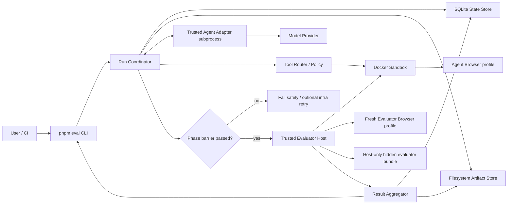
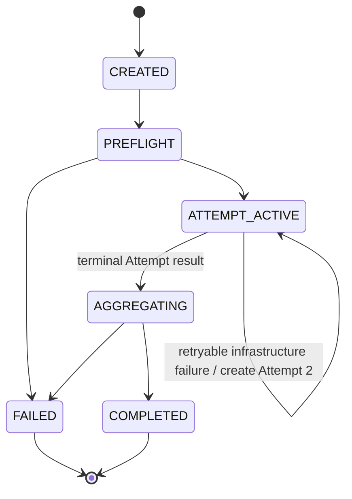
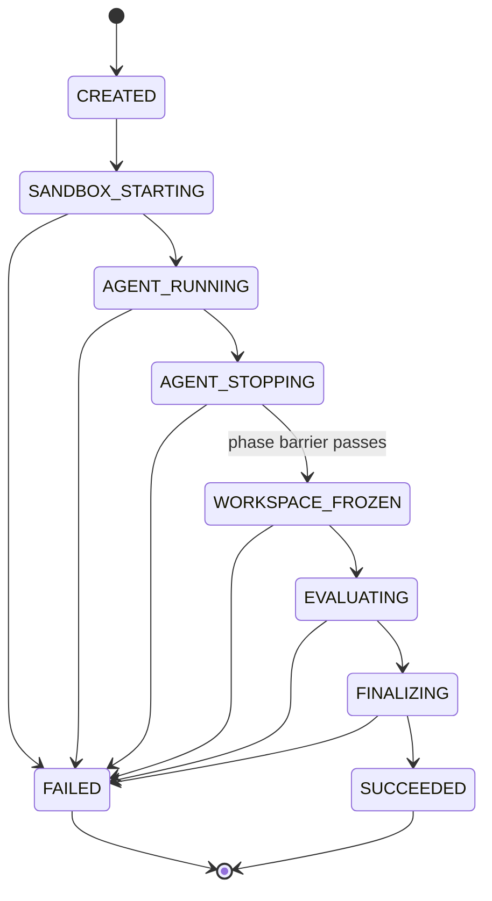

# Frontend Coding Agent 评测系统架构

> 状态：已批准  
> Slug：`frontend-agent-benchmark`  
> 日期：2026-07-10  
> 输入：已批准 `requirements.md`、已批准 `roadmap.md`、当前资料包、当前对话 Grill 决策 D1–D9

## 1. 架构结论

推荐采用**本地模块化单体 CLI**：一个可信 Coordinator 进程负责任务解析、状态机、Docker 生命周期、Evaluator 编排、SQLite 状态和 Artifact 提交；可信 Agent Adapter 作为独立宿主子进程，通过版本化 stdio JSONL 协议与 Coordinator 通信；所有模型提出的文件、Shell 和 Agent Browser 操作都经 Tool Router 进入一个逻辑 Docker Sandbox。

一次 Attempt 严格分为 Agent 和 Evaluation 两阶段。Agent 与全部子进程停止、工作区冻结、Agent Browser Profile 删除并通过 phase barrier 后，才允许 Evaluation 阶段开始。**隐藏 Evaluator 源文件始终保留在可信宿主，不挂载到 Sandbox**；宿主 Evaluator Host 通过受控命令和黑盒浏览器访问评估 Sandbox 中的结果。这是对原资料“只读挂载隐藏 evaluator”的必要修正：只读无法阻止 Agent 留下的代码在评估阶段读取隐藏文件。

SQLite 是 Run/Attempt/状态/索引的事实来源；文件系统保存 Patch、事件、日志、截图、Trace 和 Evaluator 输出。Artifact 通过 staging、checksum、manifest-finalized-last 和启动时 reconciliation 保证可恢复性。

## 2. 已确认设计约束

以下 D1–D9 来自已确认的 Grill 决策，作为架构约束而非开放建议：

| ID | 约束 |
|---|---|
| D1 | 同一逻辑 Docker Sandbox 严格两阶段运行；Agent 全部停止后才能评估，并使用全新 Evaluator Browser Profile |
| D2 | 注册并审核的 Agent Adapter 属于可信宿主代码；恶意 Adapter 不在 MVP 威胁模型内 |
| D3 | Coordinator 与 Adapter 使用版本化 stdio JSONL 子进程协议 |
| D4 | JSON Schema Draft 2020-12 是 Task、Result 和协议的唯一事实来源 |
| D5 | SQLite 保存元数据与状态，文件系统保存 Artifact |
| D6 | Benchmark/Regression 共享 Task Registry，但使用独立、不可变的 Suite 类型和版本；已发布 Suite 禁止 Bundle checksum 重叠 |
| D7 | 首批样板为一个功能开发任务和一个异步 Bug 修复任务 |
| D8 | 10 个 MVP 任务：3 功能、3 Bug、1 视觉、1 异步、1 可访问性、1 重构 |
| D9 | Infrastructure retry 是同一 Run 的新 Attempt，不计入 success@k；基础设施可靠性单独报告 |

## 3. 当前项目基线与迁移约束

当前仓库是资料包，没有生产代码、测试或既有运行数据；因此本架构不是迁移现有服务，而是为纵向切片定义最小结构。

可复用资产：

- `examples/task.yaml`：首个 Task 契约夹具。
- `examples/result.json`：Result 契约夹具。
- `schemas/task.schema.json`、`schemas/result.schema.json`：需要收紧的 Schema 起点。
- `diagrams/*.mmd`：概念数据流与评分门槛；其中隐藏 evaluator 只读挂载需要被本架构替代。

约束：

- 不引入 API、Dashboard、队列、分布式 Worker 或远程服务。
- 不把 SQLite 表、Docker Engine 调用或文件目录暴露为稳定公共 API。
- Schema、CLI、Adapter Protocol、Evaluator Plugin 和 Artifact Manifest 是稳定公共接缝。

## 4. 备选方案比较

### 方案 A — 模块化单体 CLI（推荐，最简可行）

```text
CLI/Coordinator
├─ SQLite State Store
├─ Filesystem Artifact Store
├─ Agent Adapter child process (stdio JSONL)
├─ Docker Sandbox + Tool Router
└─ Evaluator Host + Result Aggregator
```

- 覆盖：完整覆盖 FR-001–FR-016 与 D1–D9。
- 复杂度：最低；单进程拥有状态机，没有进程间队列或服务发现。
- 可运维性：本地进程、SQLite、Docker 和 Run 目录即可诊断。
- 失败行为：Coordinator 是单点，但所有状态在每次转换后持久化，可在下次 CLI 启动时 reconciliation。
- 可测试性：包边界可用内存/临时目录/Fake Docker 进行契约测试；真实 Docker 仅用于集成与安全测试。
- 可逆性：未来可把 `RunExecutor` 接口移到 Worker，不改变 Schema、Adapter 和 Evaluator 接缝。
- 接受的代价：Coordinator 崩溃会中止当前 Attempt；MVP 不做热接管，只做确定性清理与重新发起。

### 方案 B — 本地 Daemon + Worker 进程

CLI 通过本地 Socket/API 提交 Run，Daemon 持有 SQLite 和队列，Worker 执行 Docker 与 Evaluator。

- 覆盖：满足需求，天然支持后台运行和未来并发。
- 复杂度：增加 Daemon 生命周期、IPC、队列租约、版本兼容和孤儿 Worker。
- 可运维性：需要管理后台进程和日志位置，违反“只需 CLI + Docker”的最小操作心智。
- 失败行为：组件故障面更大；虽然 Worker 可重启，但 MVP 单 worker 没有实际吞吐收益。
- 可测试性：需要进程级集成测试和 Socket 故障注入。
- 可逆性：可以从方案 A 的 `RunExecutor` 后续拆出，因此不必现在支付成本。
- 结论：推迟到需要后台运行或并发时。

### 方案 C — Agent/Evaluator 双容器快照交接

Agent 容器完成后导出工作区快照，再由独立 Evaluator 容器读取快照和隐藏 Bundle。

- 覆盖：安全隔离强，故障边界清晰。
- 复杂度：两套镜像、快照格式、容器间网络和 Artifact 归属显著增加。
- 可运维性：更难复现容器间交接失败。
- 失败行为：快照或镜像不一致会成为新的 Infrastructure Error 来源。
- 可测试性：安全性更容易证明，但需要双容器矩阵。
- 可逆性：从方案 A 演进可保留 Task/Result/Evaluator 接口。
- 结论：与 D1 的 MVP 选择不符；若未来同容器 phase barrier 无法满足 NFR-001，再升级到该方案。

### 比较矩阵

| 维度 | A 模块化单体 | B Daemon + Worker | C 双容器 |
|---|---|---|---|
| 需求覆盖 | 完整 | 完整 | 完整 |
| MVP 复杂度 | **低** | 高 | 中高 |
| 隐藏数据隔离 | 宿主 Evaluator + phase barrier | 同 A | 最强 |
| 中断恢复 | 启动 reconciliation | Worker lease/requeue | 容器/快照 reconciliation |
| 本地操作性 | **最佳** | 较差 | 中等 |
| 未来并发 | 需拆 Worker | 最佳 | 需加调度 |
| 测试成本 | **最低** | 高 | 中高 |
| 决策一致性 | **符合 D1–D9** | 超出 MVP | 与 D1 冲突 |

## 5. 推荐系统上下文



Trust boundaries:

- Trusted host：CLI、Coordinator、注册 Adapter、Evaluator Host、SQLite、Artifact Store、Docker daemon、隐藏 Bundle。
- Untrusted execution：模型生成的 Tool Call、Sandbox 内工作区代码、Shell 命令、Agent Browser 内容。
- External dependency：Model Provider；仅 Adapter 可访问，凭据不进入 Sandbox。

## 6. 推荐仓库布局

```text
apps/
  cli/                         # pnpm eval entrypoint; no business logic

packages/
  contracts/                   # JSON Schemas, generated TS types, semantic validators
  task-registry/               # Task/Suite resolution, checksum, immutable publication rules
  run-coordinator/             # Run/Attempt state machines and orchestration
  state-store-sqlite/          # migrations, repositories, leases, reconciliation
  artifact-store-fs/           # staging, checksums, manifest finalization
  adapter-protocol/            # stdio JSONL framing, handshake, heartbeat, cancellation
  tool-router/                 # policy, budgets, truncation, artifact references
  sandbox-docker/              # image preflight, workspace lifecycle, phase barrier, cleanup
  evaluator-core/              # plugin lifecycle and gate semantics
  evaluator-integrity/
  evaluator-build/
  evaluator-playwright/
  evaluator-visual/
  evaluator-a11y/
  result-aggregator/           # valid/solved, score vector, efficiency, success@k
  report-cli/                  # local compare and machine-readable output

schemas/                       # canonical JSON Schema sources
datasets/
  tasks/
  suites/
fixtures/
  adapters/
  failures/
runs/                          # gitignored local output
```

Rules：

- `apps/cli` only parses arguments, performs dependency preflight, and invokes application services.
- Packages depend inward on `contracts`; infrastructure packages implement interfaces owned by orchestration/evaluator cores.
- Evaluator plugins cannot depend on Coordinator internals or SQLite tables.
- Generated TypeScript types are not hand-edited and are verified against canonical JSON Schema.

## 7. 模块职责与测试接缝

| 模块 | 职责 | Public seam | Test seam |
|---|---|---|---|
| `contracts` | Schema and semantic validation | Versioned JSON Schema | Valid/invalid fixtures and compatibility matrix |
| `task-registry` | Resolve immutable Task/Suite snapshots | `TaskRegistry` | In-memory bundles and checksum collisions |
| `run-coordinator` | Legal transitions, retry, ordering | `RunExecutor` | Fake clock, fake Adapter/Sandbox/Evaluator |
| `state-store-sqlite` | Transactions, migrations, lease, query | `RunRepository` | Temporary SQLite and crash-at-commit fault injection |
| `artifact-store-fs` | Staging, atomic commit, checksum, manifest | `ArtifactStore` | Temporary filesystem, partial-write fixtures |
| `adapter-protocol` | Framing, schema, sequencing, heartbeat | Protocol v1 | Scripted subprocess, malformed/oversized frames |
| `tool-router` | Permissions, budgets, truncation, redaction | `ToolExecutor` | Policy table tests and fake command runner |
| `sandbox-docker` | Container/workspace/browser lifecycle | `SandboxRuntime` | Fake Docker API plus real Docker security suite |
| `evaluator-core` | Plugin order, short-circuit, result validation | `EvaluatorPlugin` | Fake plugins for pass/fail/error/skip |
| Evaluator packages | Deterministic checks | Evaluator Result Schema | Gold/Alternative/Mutation fixtures |
| `result-aggregator` | valid/solved/score/efficiency semantics | `ResultAggregator` | Gate truth-table tests |
| `report-cli` | Run/Suite/config comparison | JSON report schema | Golden report fixtures |

## 8. Stable Contracts

### 8.1 JSON Schema policy

- Canonical source：JSON Schema Draft 2020-12 in `schemas/`.
- TypeScript types generated at build time; CI fails on dirty generated output.
- Structural validation occurs first; semantic validation produces stable `domain.code` errors with JSON Pointer locations.
- Unknown major version is rejected before side effects. Minor-compatible additions must be optional and cannot reinterpret existing fields.
- Existing open `additionalProperties: true` schemas are migration inputs, not accepted v1 contracts. Core objects use `additionalProperties: false`; extensibility uses explicit `extensions` namespaces.

Required v1 schemas：

```text
task, suite, run, attempt, adapter-protocol, tool-call,
evaluator-result, artifact-manifest, result, comparison-report
```

### 8.2 Adapter protocol v1

Transport：one JSON object per UTF-8 line over stdio. Adapter stdout is protocol-only; human logs use stderr and are captured separately.

Core frames：

```text
adapter → coordinator: hello, ready, event, tool_request, complete, error, heartbeat
coordinator → adapter: hello_ack, task_context, tool_result, cancel, budget_update, shutdown
```

Every frame includes `protocolVersion`, `runId`, `attemptId`, monotonic `seq`, `type`, `timestamp`, and typed `payload`. The Coordinator validates before acting and persists the accepted frame before executing a Tool Call. Duplicate `seq` is idempotently rejected; gaps are protocol errors. Maximum frame size and heartbeat timeout are configurable defaults recorded in Run inputs.

### 8.3 Evaluator plugin contract

```text
metadata(): id, version, stage, prerequisites, deterministic
prepare(context): validate required inputs without executing target code
execute(context): produce bounded structured result + Artifact refs
cleanup(context): idempotent cleanup
```

An Evaluator cannot mutate prior results, Run inputs, or the frozen Patch. Every output must validate against `evaluator-result.schema.json` before aggregation.

### 8.4 Artifact contract

Artifact paths are relative to one Attempt directory; database rows store metadata, not binary payloads. Manifest entries include logical type, producer, MIME, size, sha256, relative path, lifecycle status, and optional `not_applicable` reason.

The finalized manifest is written last. A Result may reference only entries in a finalized manifest whose checksum passes.

## 9. Data Model

### SQLite entities

| Entity | Load-bearing fields | Invariants |
|---|---|---|
| `schema_migrations` | version, applied_at, checksum | Forward-only; binary refuses unknown newer DB |
| `tasks` | task_id, version, bundle_checksum, schema_version, path | `(task_id, version)` and checksum immutable |
| `suites` | suite_id, version, type, manifest_checksum, published_at | Published row immutable; type is benchmark/regression |
| `suite_tasks` | suite_id/version, task_id/version, bundle_checksum | Published Benchmark/Regression checksums cannot overlap |
| `runs` | run_id, input_hash, status, requested_k, created/finished | Inputs immutable after PREFLIGHT |
| `attempts` | attempt_id, run_id, ordinal, seed, status, failure_code | Ordinal 1–2 only; Attempt 2 only after retryable infra code |
| `transitions` | attempt_id, seq, from_state, to_state, reason, at | Append-only and unique sequence |
| `evaluator_results` | attempt_id, evaluator id/version, status, result_json, artifact refs | One finalized result per evaluator execution |
| `artifacts` | attempt_id, logical_type, path, checksum, status | Final rows must exist in finalized manifest |
| `results` | run_id, schema_version, valid, solved, result_json | One immutable final Result per completed Run |

### Artifact layout

```text
runs/<run-id>/
  state.json                       # derived from SQLite; recovery snapshot
  input.json                       # immutable resolved input
  attempts/
    1/
      patch.diff
      agent-events.jsonl
      commands.log
      adapter.stderr.log
      screenshots/
      playwright-trace.zip
      evaluator-results/
      manifest.json
    2/                             # only when Infrastructure retry occurs
  result.json
  comparison-metadata.json
```

Writes start in `.tmp/<run-id>/<attempt-id>/`. Files are fsynced, checksummed, and renamed into the visible Attempt directory; `manifest.json` is finalized last. SQLite records the finalized manifest in one transaction. Startup reconciliation quarantines unexpected files and regenerates derived `state.json` from SQLite.

## 10. State Machines

### Run



### Attempt



State rules：

- State transition is committed to SQLite before external work begins; completion is another committed transition.
- Restart never resumes a model session within an existing Attempt. It cleans the sandbox and either finalizes a safely completed phase or ends the Attempt with Infrastructure Error.
- Retry uses the same immutable input hash and seed but a new Attempt ID and fresh Sandbox state.
- success@k counts independent requested Runs, never Attempts.

## 11. End-to-End Flow

```mermaid
sequenceDiagram
  autonumber
  participant U as User/CI
  participant C as Coordinator
  participant D as SQLite/Artifact Store
  participant A as Trusted Adapter
  participant S as Docker Sandbox
  participant E as Host Evaluator

  U->>C: eval run task-id --agent config --seed N
  C->>C: schema + semantic + environment preflight
  C->>D: persist immutable Run and Attempt 1
  C->>S: create sandbox; inject public bundle only
  C->>A: spawn and handshake over JSONL
  loop Agent phase
    A->>C: tool_request
    C->>C: validate policy and budget
    C->>S: execute file/shell/browser action
    S-->>C: bounded result + Artifact ref
    C-->>A: tool_result
  end
  A-->>C: complete/error/budget stop
  C->>A: shutdown; wait/kill on deadline
  C->>S: terminate descendants; remove Agent browser profile
  C->>S: capture patch and workspace checksum
  C->>C: verify phase barrier
  Note over E,S: Hidden evaluator bundle remains host-only
  C->>E: run ordered evaluator pipeline
  E->>S: integrity/build/start via controlled commands
  E->>S: black-box Playwright/visual/a11y against app
  E->>D: validated evaluator results and Artifacts
  C->>C: aggregate gates, quality vector, efficiency
  C->>D: finalize manifest then Result
  C-->>U: summary and run path
```

## 12. Hidden Data and Security Model

### Phase barrier

The transition to `WORKSPACE_FROZEN` requires all checks to pass：

1. Adapter exited or was killed after cancellation deadline.
2. Sandbox process census contains only the known supervisor/idle process; all Agent descendants and Agent Browser processes are gone.
3. Agent Browser Profile is removed; Evaluator uses a fresh profile and port.
4. Public workspace Patch and checksum are captured.
5. No hidden Bundle path, mount, environment variable, token, or filename exists in the Sandbox.
6. Tool Router is closed to the Adapter before any evaluator begins.

Failure to prove any item produces Infrastructure Error and destroys the Sandbox before any hidden evaluator is read.

### Host-only hidden evaluator

- Hidden test source, references, rubrics, Gold/Alternative and Mutation metadata stay under a host-only Evaluator Bundle path.
- Sandbox receives only opaque public identifiers, task-required runtime data, and commands that reveal no hidden assertion text.
- Host Playwright launches a fresh browser context against the application endpoint exposed only on a random loopback port.
- Build/start commands may execute untrusted project scripts in Sandbox, but those scripts have no filesystem or environment path to hidden Bundle content.
- Evaluator outputs are sanitized before being exposed in user-facing summaries; raw hidden assertion details remain protected Artifacts.

### Credentials and logs

- Model credentials exist only in the trusted Adapter subprocess environment.
- Coordinator passes allowlisted variables; Docker never inherits host environment wholesale.
- Protocol frames, stderr, command logs and network summaries run through deterministic redaction before persistence.
- Secrets scanning is an implementation-stage gate for config/examples; architecture only defines the boundary.

## 13. Evaluator Pipeline and Aggregation

```text
Integrity
  → Install / Typecheck / Lint / Existing Tests / Production Build / Start
  → Hidden Functional Playwright
  → Visual / Responsive
  → Accessibility
  → Engineering Checks
  → Aggregation
```

Gate semantics：

- Integrity violation → `valid=false`, `solved=false`; later quality evaluators skip.
- Infrastructure failure → no quality conclusion; eligible for one retry if code is allowlisted.
- Build/start failure → `valid=true` if integrity passed, `solved=false`; later app-dependent evaluators skip.
- Critical functional failure → `solved=false`; visual/a11y can still run only if configured for diagnostic value, never to offset the gate.
- Non-critical visual/a11y failure → vector score/failure evidence; Task gate configuration decides solved.
- Evaluator Error is distinct from tested behavior failure and cannot be interpreted as Agent Failure.

The aggregator is a pure function over validated inputs: resolved Task gate policy, finalized Attempt classification, Evaluator Results and efficiency counters. It never reads raw logs to infer a status.

## 14. Failure Classification and Recovery

Stable category examples：

| Category | Examples | Retry |
|---|---|---|
| `invalid` | hidden-data access, forbidden path write, verifier tampering | Never |
| `agent_failure` | Adapter-declared failure, invalid protocol after handshake, target behavior failure | Never |
| `budget_exhausted` | wall time, steps, cost | Never |
| `infrastructure_error` | Docker unavailable/startup failure, phase-barrier cleanup failure, host disk transient error | Once, allowlist only |
| `evaluator_error` | evaluator crash/schema-invalid result | Never automatically in MVP |
| `solved` | all required gates pass | N/A |

Recovery rules：

- Cleanup is idempotent and keyed by Attempt ID.
- Infrastructure retry creates Attempt 2 from the original input, never from Attempt 1 workspace.
- Coordinator interruption triggers lease inspection and reconciliation on the next CLI start; it never silently resumes Agent execution.
- Partial Artifact staging is quarantined. Final Result is written only after finalized manifest and database transaction succeed.
- Database migration makes a backup before applying; unknown newer migration or Schema version causes startup refusal, not implicit downgrade.

## 15. Observability

Every event includes Run ID, Attempt ID, transition/tool/evaluator sequence, phase, timestamp, duration, outcome and stable code. Required local views：

- `eval run show <run-id>`：state, attempts, gates, failures and Artifact paths.
- `eval run doctor <run-id>`：reconciliation and environment evidence without rerunning Agent.
- `eval compare ...`：quality vector, success@k, raw/retried infrastructure rate, cost and time.

Metrics separation：

- Agent quality：valid, solved, dimension vector, success@1/any@k/all@k.
- Agent efficiency：tokens, Tool Calls, wall time, cost, self-test/fix counts when Adapter reports them.
- Platform reliability：first-Attempt Infrastructure Error, final Infrastructure Error after retry, cleanup/reconciliation failures.

Full payloads remain Artifacts; CLI defaults to bounded summaries.

## 16. Rollout and Rollback

This is a local CLI, so rollout is schema- and stage-driven rather than service deployment.

- Every vertical stage adds an observable command/fixture and keeps prior commands working.
- Experimental Evaluators remain opt-in until Gold/Alternative/Mutation calibration passes.
- Schema major versions use side-by-side fixtures/readers; minor changes are additive.
- SQLite migration creates a timestamped backup. Rollback uses the previous binary with the pre-migration backup; no automatic down migration.
- Artifact formats are immutable once finalized. New readers may support old manifests; old Artifacts are never rewritten in place.
- If same-Sandbox isolation fails NFR-001, stop release and replace `SandboxRuntime` with the two-container scheme without changing Task, Adapter, Evaluator Result or final Result contracts.

## 17. Vertical Implementation Stages

Each stage is independently implementable and ends with observable behavior.

### V0 — Contracts and deterministic fixtures

- Delivers：canonical JSON Schemas, generated TS types, semantic validators, version compatibility matrix, valid/invalid fixtures.
- Observable behavior：`pnpm eval validate examples/task.yaml` returns structured success; invalid fixtures return stable JSON Pointer errors.
- Verification：schema fixture tests, generated-file drift check, unknown-major rejection.
- Requirements：FR-001/002/009/010, NFR-006.

### V1 — Durable Run shell

- Delivers：CLI skeleton, SQLite migrations/repositories, Artifact staging/manifest, Run/Attempt state machines, derived `state.json`, startup reconciliation.
- Observable behavior：a no-op Run progresses through scripted states and survives injected interruption without producing a false completed Result.
- Verification：state transition truth table, crash-at-commit tests, partial-file recovery, migration backup test.
- Requirements：FR-002/011/015, NFR-004/005/007/008.

### V2 — Adapter protocol and Mock Agent

- Delivers：stdio JSONL v1, handshake/capabilities, event sequencing, heartbeat/cancel, budget counters, Tool Router fakes, Mock/command Adapter.
- Observable behavior：Mock Agent produces validated events and a patch; malformed, oversized, stalled and out-of-sequence frames end with stable codes.
- Verification：protocol conformance kit, subprocess crash tests, output truncation/redaction tests.
- Requirements：FR-005/009/010/015.

### V3 — Docker Sandbox and phase barrier

- Delivers：public Bundle injection, filesystem/shell/Agent-browser tools, permissions/budgets, process cleanup, workspace freeze, fresh Evaluator profile, host-only hidden Bundle boundary.
- Observable behavior：Agent can modify the sample app but cannot enumerate hidden data; after shutdown the phase barrier either proves cleanup or safely fails.
- Verification：path traversal, mount/process/env search, daemon/background process, browser residue, budget and network tests.
- Requirements：FR-003/004/006, NFR-001/007/008, SC-004.

### V4 — Deterministic evaluator vertical slice

- Delivers：Integrity, Build and hidden Functional Playwright plugins, Aggregator, final Result, full Artifact directory, `react-orders-filter-017` end-to-end command.
- Observable behavior：the required `pnpm eval run react-orders-filter-017` flow emits a valid Result and navigable evidence; failure fixtures produce correct gate outcomes.
- Verification：gold path, build failure, critical functional failure, forbidden modification, infrastructure failure/retry and evaluator crash tests.
- Requirements：FR-007–011/016, SC-001/007/008.

### V5 — Visual, responsive, accessibility and two-task calibration

- Delivers：Visual/Responsive/A11y plugins, baseline assets, feature sample, asynchronous Bug sample, Gold/Alternative/Mutation calibration report.
- Observable behavior：both correct implementations pass and all declared Mutations fail with expected codes.
- Verification：calibration matrix, viewport/browser/font pinning, screenshot and trace checksums.
- Requirements：FR-007/008/014, NFR-002/003, SC-002/003/005.

### V6 — Repeats, comparison and 10-task MVP

- Delivers：seed lists, independent Run groups, success@k, CLI/JSON comparison, published Regression/Benchmark Suite snapshots, 10 calibrated tasks using D8 distribution, 50-Run reliability baseline.
- Observable behavior：two Agent configurations can be compared for quality, stability and efficiency; Attempts are excluded from k; published Suite checksum overlap is rejected.
- Verification：aggregation math fixtures, Suite publication rules, 50-Run report, all-task calibration matrix.
- Requirements：FR-012–014, NFR-002–004, SC-005/006/009/010.

## 18. Requirement Traceability

| Requirement | Primary modules | Stage | Verification signal |
|---|---|---|---|
| FR-001 | contracts, task-registry, cli | V0 | valid/invalid Task fixtures |
| FR-002 | coordinator, contracts, SQLite | V0–V1 | immutable input hash and version record |
| FR-003 | sandbox-docker, tool-router | V3 | permission/network/budget tests |
| FR-004 | sandbox-docker, Evaluator Host | V3 | hidden-data attack suite: zero disclosure |
| FR-005 | adapter-protocol | V2 | protocol conformance kit |
| FR-006 | coordinator, sandbox-docker | V3 | phase-barrier tests |
| FR-007 | evaluator-core | V4–V5 | ordered plugin/skip tests |
| FR-008 | evaluator-core, aggregator | V4 | gate truth table |
| FR-009 | contracts, coordinator | V1–V4 | stable failure fixture matrix |
| FR-010 | aggregator, protocol | V2–V4 | Result Schema and metric separation |
| FR-011 | artifact-store-fs | V1–V4 | finalized manifest/checksums |
| FR-012 | coordinator, report-cli | V6 | success@k fixtures |
| FR-013 | report-cli, SQLite | V6 | two-config comparison golden file |
| FR-014 | registry, evaluators | V5–V6 | Gold/Alternative/Mutation matrix |
| FR-015 | coordinator | V1/V4 | one retry maximum and Attempt history |
| FR-016 | cli, all vertical components | V4 | required command produces Run directory |

NFR-001 is the V3 release blocker; NFR-002/003 block task publication; NFR-004 blocks MVP completion after V6; NFR-005/006/007/008 are enforced continuously by V0/V1/V3 verification.

## 19. Cross-Skill Routing

### `harness-engineering:harness-design`

- Trigger：Agent pipeline, Tool Router, structured model output, state machine, retry and evaluator boundaries。
- Output：`.harness-engineering/frontend-agent-benchmark/harness-design.md`。
- Influence：added Coordinator-owned transitions, protocol validation, tool-output caps, derived `state.json`, phase barrier, retry locality and restart invariants.

### `antifragile:antifragile-audit --scope system`

- Trigger：Docker/Model Provider dependencies, SQLite + filesystem persistence, cleanup, retries and degraded operation。
- Availability note：the advertised `antifragile-system` path was absent after plugin cache refresh; the installed equivalent read-only `antifragile-audit --scope system` instructions were used.
- Result folded into this architecture：

| Rank | Evidence/trigger | Consequence | Smallest architecture repair |
|---|---|---|---|
| critical | Original `CODEX_TASK.md` proposes read-only hidden evaluator mount; untrusted project code executes during evaluation | Project code could read or leak hidden source even after Agent process exits | Keep hidden Bundle host-only; black-box evaluator access only |
| warning | SQLite rows and filesystem Artifact writes can partially succeed | Completed status may reference missing/corrupt evidence | Staging + checksum + manifest-last + DB transaction + reconciliation |
| warning | Same Sandbox phase reuse can leave child/browser processes | Residual Agent activity could observe evaluation | Process census, kill deadline, profile deletion, barrier failure destroys Sandbox |
| warning | Broad retry on a misclassified failure | Hides Agent failures and distorts success@k | Stable allowlisted infrastructure codes; new Attempt; Attempts excluded from k |
| warning | JSONL subprocess can stall or emit unbounded output | Coordinator hang or memory/disk pressure | Heartbeat, max frame, backpressure, cancellation and Artifact caps |
| warning | Host Adapter owns model credentials | Logs or Docker env could leak secrets | allowlisted env, deterministic redaction, never inherit secrets into Docker |
| info/pass | Requirements separate quality from efficiency and infra reliability | Avoids score contamination | Preserve three metric families |
| info/pass | Requirements define fixed environment, deterministic gates and one retry | Reproduction and diagnosis have measurable anchors | Enforce in immutable input and transition tests |

### Other routes

- UI design route skipped：Dashboard is explicitly outside MVP.
- Commercialization skipped：not requested and no commercial evidence was supplied.
- Secret scan skipped at architecture stage：no credentials/config or production code were written; secret constraints are recorded for implementation-stage scanning.

## 20. Accepted Tradeoff

方案 A intentionally accepts one trusted Coordinator process and one logical Sandbox instead of a Daemon/Worker or dual-container system. This minimizes components and makes the first end-to-end result debuggable. The price is that Coordinator interruption ends the current Attempt and same-Sandbox isolation needs a strong phase barrier. The architecture contains an explicit upgrade seam: if NFR-001 cannot be proven, replace `SandboxRuntime` with dual-container snapshot handoff while retaining public contracts.

## 21. Architecture Approval

Decision needed：approve方案 A and specifically approve the security refinement that hidden Evaluator source remains host-only rather than being read-only mounted into Sandbox.

Recommended：approve. It is the smallest design that satisfies the confirmed MVP scope and closes the most serious hidden-test leakage path without adding a second container or service architecture.

Affected artifacts：

- `.idea-to-ship/frontend-agent-benchmark/architecture.md`
- `.harness-engineering/frontend-agent-benchmark/harness-design.md`

If approved：run `$idea-to-ship:review --target design --slug frontend-agent-benchmark` for independent design validation before TDD/implementation.

### Approval Record

- Date：2026-07-10
- Decision：approved方案 A（模块化单体 CLI）and the host-only hidden Evaluator security boundary.
- Source：Plannotator human approval.
- Approved artifact：this file.
- Next action：`$idea-to-ship:review --target design --slug frontend-agent-benchmark`.
