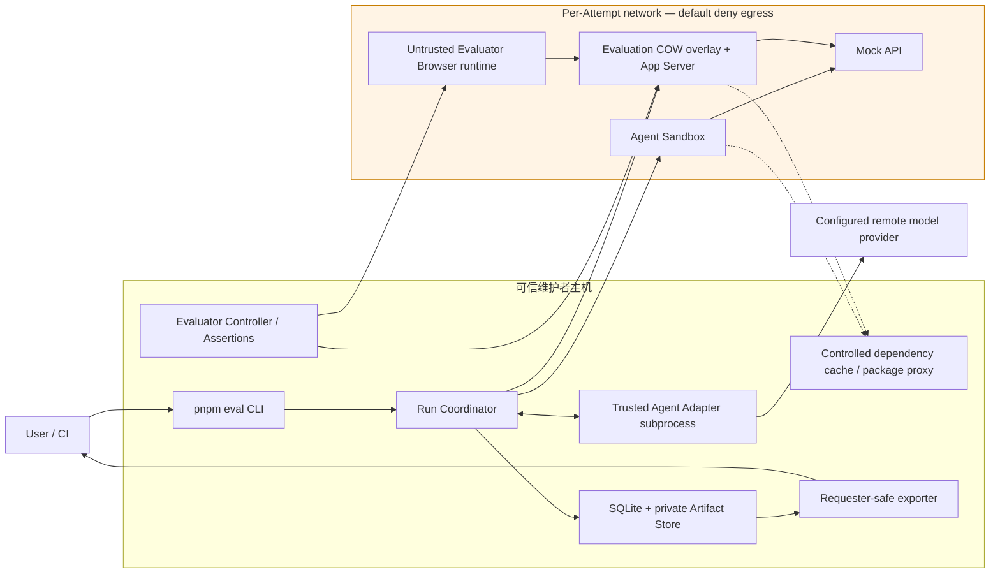
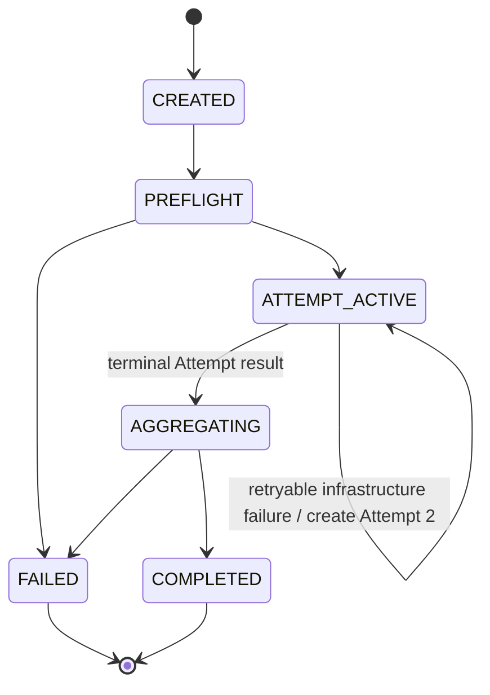
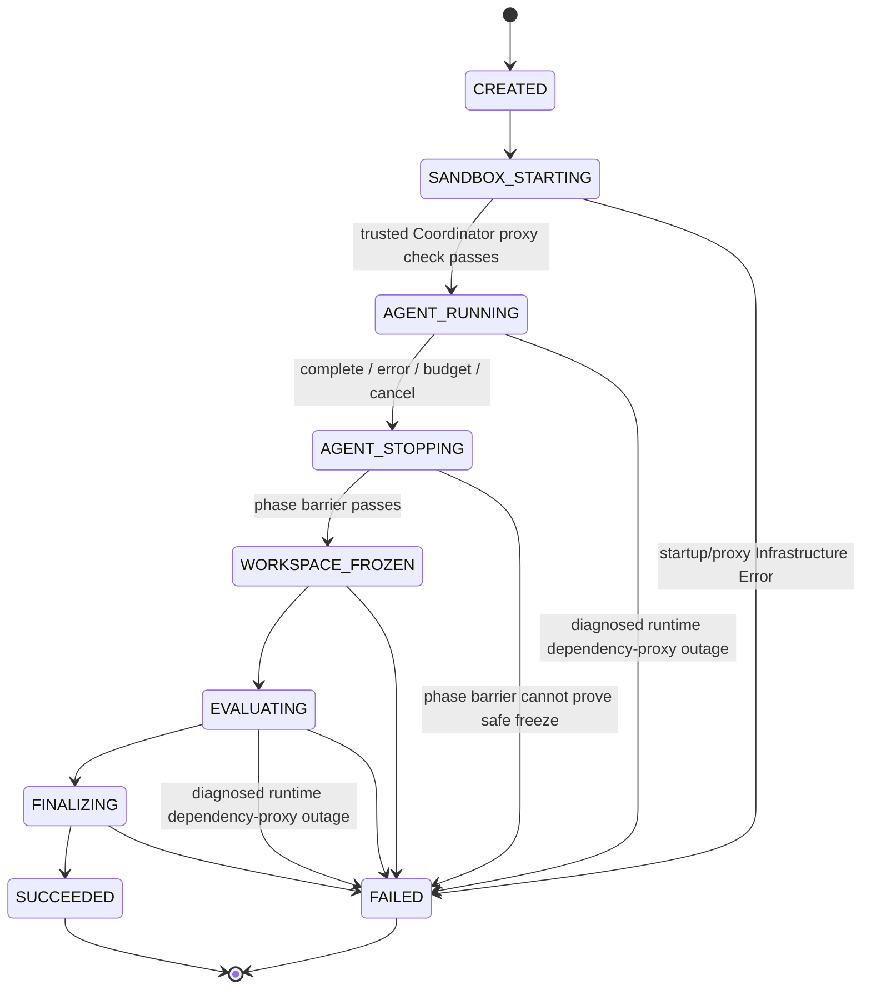

# Frontend Coding Agent 评测系统架构

> 状态：已批准（2026-07-13 修订已同步）  
> Slug：`frontend-agent-benchmark`  
> 日期：2026-07-13  
> 输入：已批准 `requirements.md`、已批准 `roadmap.md`、当前资料包、当前对话 Grill 决策 D1–D9、R1–R9

## 1. 架构结论

推荐采用**受控网络的本地模块化单体 CLI**：一个可信 Coordinator 进程负责任务解析、状态机、Docker 生命周期、Evaluator 编排、SQLite 状态和 Artifact 提交；可信 Agent Adapter 作为独立宿主子进程，通过版本化 stdio JSONL 协议与 Coordinator 通信，并在宿主控制平面访问已配置的远程模型提供商；所有模型提出的文件、Shell 和 Agent Browser 操作都经 Tool Router 进入一个逻辑 Docker Sandbox。

一次 Attempt 严格分为 Agent 和 Evaluation 两阶段。Agent 与全部子进程停止、工作区冻结、Agent Browser Profile 删除并通过 phase barrier 后，才允许 Evaluation 阶段开始。**隐藏 Evaluator 源文件始终保留在可信宿主，不挂载到 Sandbox**；宿主 Evaluator Host 通过受控命令和黑盒浏览器访问评估 Sandbox 中的结果。这是对原资料“只读挂载隐藏 evaluator”的必要修正：只读无法阻止 Agent 留下的代码在评估阶段读取隐藏文件。

Agent 与 Evaluation 两阶段的 Sandbox 网络均默认拒绝宿主、LAN 与互联网。它们只可访问同一 Attempt 内声明的 Mock API、应用、隔离 Browser、受控 Controller 与锁定依赖的受控缓存/包代理；Evaluation 的应用服务器、COW 命令和 Browser 适用同一策略，不能 relay 隐藏行为。隐藏 Evaluator 源码和行为数据为 maintainer-only；请求者只能取得显式脱敏导出。

SQLite 是 Run/Attempt/状态/索引的事实来源；文件系统保存 Patch、事件、日志、截图、Trace 和 Evaluator 输出。Artifact 通过 staging、checksum、manifest-finalized-last 和启动时 reconciliation 保证可恢复性。

## 2. 已确认设计约束

以下 D1–D9 及 2026-07-13 已批准的 R1–R9 来自 Grill 决策，作为架构约束而非开放建议：

| ID | 约束 |
|---|---|
| D1 | 同一逻辑 Docker Sandbox 严格两阶段运行；Agent 全部停止后才能评估，并使用全新 Evaluator Browser Profile |
| D2 | 注册并审核的 Agent Adapter 属于可信宿主代码；恶意 Adapter 不在 MVP 威胁模型内 |
| D3 | Coordinator 与 Adapter 使用版本化 stdio JSONL 子进程协议 |
| D4 | JSON Schema Draft 2020-12 是 Task、Result 和协议的唯一事实来源 |
| D5 | SQLite 保存元数据与状态，文件系统保存 Artifact |
| D6 | Benchmark/Regression 共享 Task Registry，但使用独立、不可变的 Suite 类型和版本；已发布 Suite 禁止 Bundle checksum 重叠 |
| D7 | 首批样板为一个功能开发任务和一个异步 Bug 修复任务 |
| D8 | 10 个 MVP 任务：3 功能、3 Bug、1 视觉、1 异步、1 可访问性、1 重构 |
| D9 | Infrastructure retry 是同一 Run 的新 Attempt，不计入 success@k；基础设施可靠性单独报告 |
| R1 | Agent 与 Evaluation 两阶段均默认拒绝宿主、LAN 与互联网；只开放同一 Run 内 Mock、应用、隔离 Browser、受控 Controller 和受控包代理 |
| R2 | 隐藏 Evaluator 源码、输入、路由、Mock 响应、时序与断言触发均不得泄露给 Agent 或请求者 |
| R3 | 完整隐藏 Artifact 仅维护者可访问；请求者只能取得显式脱敏导出 |
| R4 | Benchmark 与 Regression 采用相同严格的网络、Artifact 与导出策略 |
| R5 | Sandbox 网络策略违规为 `Invalid`，立即停止当前阶段且不自动重试 |
| R6 | Bundle、Mock、日志、Trace、截图和 Result 仅允许合成或不可逆匿名化数据；禁止凭据和生产数据 |
| R7 | 依赖安装必须锁定并经维护者控制的缓存/包代理；缓存缺失在 Agent 启动前拒绝 |
| R8 | 宿主/Coordinator/注册 Adapter/Docker daemon 可信；被测代码不可信；Docker、Browser 和内核 0-day 与多租户隔离不在 MVP 承诺内 |
| R9 | 远程模型调用仅由可信宿主 Adapter 发起；记录提供商/模型/版本/采样配置和可用性，凭据不进入 Sandbox、Artifact 或导出包 |

## 3. 当前项目基线与迁移约束

当前仓库是资料包，没有生产代码、测试或既有运行数据；因此本架构不是迁移现有服务，而是为纵向切片定义最小结构。

可复用资产：

- `examples/task.yaml`：首个 Task 契约夹具。
- `examples/result.json`：Result 契约夹具。
- `schemas/task.schema.json`、`schemas/result.schema.json`：需要收紧的 Schema 起点。
- `diagrams/*.mmd`：概念数据流与评分门槛；其中隐藏 evaluator 只读挂载需要被本架构替代。

约束：

- 不引入 API、Dashboard、队列、分布式 Worker 或远程服务。
- 不把 SQLite 表、Docker Engine 调用或文件目录暴露为稳定公共 API。
- Schema、CLI、Adapter Protocol、Evaluator Plugin 和 Artifact Manifest 是稳定公共接缝。

## 4. 备选方案比较

### 方案 A — 模块化单体 CLI（推荐，最简可行）

```text
CLI/Coordinator
├─ SQLite State Store
├─ Filesystem Artifact Store
├─ Agent Adapter child process (stdio JSONL)
├─ Docker Sandbox + Tool Router + default-deny Network Policy
├─ Controlled dependency cache / package proxy
├─ Maintainer-only Artifact Store + requester-safe Exporter
└─ Evaluator Host + Result Aggregator
```

- 覆盖：完整覆盖 FR-001–FR-016、NFR-001–NFR-010 与 D1–D9/R1–R9。
- 复杂度：最低；单进程拥有状态机，没有进程间队列或服务发现。
- 可运维性：本地进程、SQLite、Docker 和 Run 目录即可诊断。
- 失败行为：Coordinator 是单点，但所有状态在每次转换后持久化，可在下次 CLI 启动时 reconciliation。
- 可测试性：包边界可用内存/临时目录/Fake Docker 进行契约测试；真实 Docker 仅用于集成与安全测试。
- 可逆性：未来可把 `RunExecutor` 接口移到 Worker，不改变 Schema、Adapter 和 Evaluator 接缝。
- 接受的代价：Coordinator 崩溃会中止当前 Attempt；MVP 不做热接管，只做确定性清理与重新发起。

### 方案 B — 本地 Daemon + Worker 进程

CLI 通过本地 Socket/API 提交 Run，Daemon 持有 SQLite 和队列，Worker 执行 Docker 与 Evaluator。

- 覆盖：满足需求，天然支持后台运行和未来并发。
- 复杂度：增加 Daemon 生命周期、IPC、队列租约、版本兼容和孤儿 Worker。
- 可运维性：需要管理后台进程和日志位置，违反“只需 CLI + Docker”的最小操作心智。
- 失败行为：组件故障面更大；虽然 Worker 可重启，但 MVP 单 worker 没有实际吞吐收益。
- 可测试性：需要进程级集成测试和 Socket 故障注入。
- 可逆性：可以从方案 A 的 `RunExecutor` 后续拆出，因此不必现在支付成本。
- 结论：推迟到需要后台运行或并发时。

### 方案 C — Agent/Evaluator 双容器快照交接

Agent 容器完成后导出工作区快照，再由独立 Evaluator 容器读取快照和隐藏 Bundle。

- 覆盖：安全隔离强，故障边界清晰。
- 复杂度：两套镜像、快照格式、容器间网络和 Artifact 归属显著增加。
- 可运维性：更难复现容器间交接失败。
- 失败行为：快照或镜像不一致会成为新的 Infrastructure Error 来源。
- 可测试性：安全性更容易证明，但需要双容器矩阵。
- 可逆性：从方案 A 演进可保留 Task/Result/Evaluator 接口。
- 结论：与 D1 的 MVP 选择不符；若未来同容器 phase barrier 无法满足 NFR-001，再升级到该方案。

### 比较矩阵

| 维度 | A 模块化单体 | B Daemon + Worker | C 双容器 |
|---|---|---|---|
| 需求覆盖 | 完整 | 完整 | 完整 |
| MVP 复杂度 | **低** | 高 | 中高 |
| 隐藏数据隔离 | 宿主 Evaluator + phase barrier | 同 A | 最强 |
| 中断恢复 | 启动 reconciliation | Worker lease/requeue | 容器/快照 reconciliation |
| 本地操作性 | **最佳** | 较差 | 中等 |
| 未来并发 | 需拆 Worker | 最佳 | 需加调度 |
| 测试成本 | **最低** | 高 | 中高 |
| 决策一致性 | **符合 D1–D9** | 超出 MVP | 与 D1 冲突 |

## 5. 推荐系统上下文



Trust boundaries:

- Trusted host：CLI、Coordinator、注册 Adapter、Evaluator Controller/assertions、SQLite、私有 Artifact Store、受控包代理、Docker daemon 与隐藏 Bundle。
- Untrusted execution：模型生成的 Tool Call、Sandbox 内工作区代码、Shell 命令、应用服务器、COW 命令、Agent Browser 与 Evaluator Browser runtime。
- Adapter → Model Provider 是宿主控制平面；凭据、端点及未脱敏原始响应不进入 Sandbox、Artifact 或导出包。
- Attempt 网络没有到宿主、LAN 或互联网的路径；Browser、应用服务器与 COW 命令不能反向连接 Evaluator Controller。

## 6. 推荐仓库布局

```text
apps/
  cli/                         # pnpm eval entrypoint; no business logic

packages/
  contracts/                   # JSON Schemas, generated TS types, semantic validators
  task-registry/               # Task/Suite resolution, checksum, immutable publication rules
  run-coordinator/             # Run/Attempt state machines and orchestration
  state-store-sqlite/          # migrations, repositories, leases, reconciliation
  artifact-store-fs/           # staging, checksums, manifest finalization
  adapter-protocol/            # stdio JSONL framing, handshake, heartbeat, cancellation
  tool-router/                 # policy, budgets, truncation, artifact references
  sandbox-docker/              # image preflight, workspace lifecycle, phase barrier, cleanup
  network-policy/              # default-deny Attempt topology and policy-violation evidence
  dependency-cache/            # lockfile/cache-snapshot preflight and controlled proxy
  evaluator-core/              # plugin lifecycle and gate semantics
  evaluator-integrity/
  evaluator-build/
  evaluator-playwright/
  evaluator-visual/
  evaluator-a11y/
  result-aggregator/           # valid/solved, score vector, efficiency, success@k
  export-policy/               # artifact audience, redaction, export manifest
  data-scan/                   # coverage policy + disposable scanner-worker supervisor
  report-cli/                  # local compare and machine-readable output

schemas/                       # canonical JSON Schema sources
datasets/
  tasks/
  suites/
fixtures/
  adapters/
  failures/
runs/                          # gitignored local output
```

Rules：

- `apps/cli` only parses arguments, performs dependency preflight, and invokes application services.
- Packages depend inward on `contracts`; infrastructure packages implement interfaces owned by orchestration/evaluator cores.
- Evaluator plugins cannot depend on Coordinator internals or SQLite tables.
- Generated TypeScript types are not hand-edited and are verified against canonical JSON Schema.

## 7. 模块职责与测试接缝

| 模块 | 职责 | Public seam | Test seam |
|---|---|---|---|
| `contracts` | Schema and semantic validation | Versioned JSON Schema | Valid/invalid fixtures and compatibility matrix |
| `task-registry` | Resolve immutable Task/Suite snapshots | `TaskRegistry` | In-memory bundles and checksum collisions |
| `run-coordinator` | Legal transitions, retry, ordering | `RunExecutor` | Fake clock, fake Adapter/Sandbox/Evaluator |
| `state-store-sqlite` | Transactions, migrations, lease, query | `RunRepository` | Temporary SQLite and crash-at-commit fault injection |
| `artifact-store-fs` | Staging, atomic commit, checksum, manifest | `ArtifactStore` | Temporary filesystem, partial-write fixtures |
| `adapter-protocol` | Framing, schema, sequencing, heartbeat | Protocol v1 | Scripted subprocess, malformed/oversized frames |
| `tool-router` | Permissions, budgets, truncation, redaction | `ToolExecutor` | Policy table tests and fake command runner |
| `sandbox-docker` | Container/workspace/browser lifecycle | `SandboxRuntime` | Fake Docker API plus real Docker security suite |
| `network-policy` | Default-deny Agent/Evaluation networks and relay prevention | `AttemptNetworkPolicy` | Host/LAN/internet/redirect/WebSocket/relay fixtures |
| `dependency-cache` | Lockfile/cache-snapshot verification and fixed proxy configuration | `DependencySnapshot` | Lock/cache-miss/proxy-unavailable fixtures |
| `evaluator-core` | Plugin order, short-circuit, result validation | `EvaluatorPlugin` | Fake plugins for pass/fail/error/skip |
| Evaluator packages | Deterministic checks | Evaluator Result Schema | Gold/Alternative/Mutation fixtures |
| `result-aggregator` | valid/solved/score/efficiency semantics | `ResultAggregator` | Gate truth-table tests |
| `report-cli` | Run/Suite/config comparison | JSON report schema | Golden report fixtures |
| `export-policy` | Audience classification, redaction and export closure | `RunExporter` | Allowlist/denylist and private-ref rejection fixtures |
| `data-scan` | Bundle/Artifact hygiene gate and scanner-worker supervisor | `DataScan` | Synthetic-data, credential and hostile-decoder fixtures |

## 8. Stable Contracts

### 8.1 JSON Schema policy

- Canonical source：JSON Schema Draft 2020-12 in `schemas/`.
- TypeScript types generated at build time; CI fails on dirty generated output.
- Structural validation occurs first; semantic validation produces stable `domain.code` errors with JSON Pointer locations.
- Unknown major version is rejected before side effects. Minor-compatible additions must be optional and cannot reinterpret existing fields.
- Existing open `additionalProperties: true` schemas are migration inputs, not accepted v1 contracts. Core objects use `additionalProperties: false`; extensibility uses explicit `extensions` namespaces.

Required v1 schemas：

```text
task, suite, run, attempt, adapter-protocol, tool-call,
evaluator-result, artifact-manifest, result, comparison-report,
dependency-cache-snapshot, network-policy, producer-record,
export-manifest, requester-export-result, data-scan-result,
data-scan-coverage-policy, proxy-diagnostic-record
```

### 8.2 Adapter protocol v1

Transport：one JSON object per UTF-8 line over stdio. Adapter stdout is protocol-only; human logs use stderr and are captured separately.

Core frames：

```text
adapter → coordinator: hello, ready, event, tool_request, complete, error, heartbeat
coordinator → adapter: hello_ack, task_context, tool_result, cancel, budget_update, shutdown
```

Every frame includes `protocolVersion`, `runId`, `attemptId`, monotonic `seq`, `type`, `timestamp`, and typed `payload`. The Coordinator validates before acting and persists the accepted frame before executing a Tool Call. Duplicate `seq` is idempotently rejected; gaps are protocol errors. Maximum frame size and heartbeat timeout are configurable defaults recorded in Run inputs.

### 8.3 Evaluator plugin contract

```text
metadata(): id, version, stage, prerequisites, deterministic
prepare(context): validate required inputs without executing target code
execute(context): produce bounded structured result + Artifact refs
cleanup(context): idempotent cleanup
```

An Evaluator cannot mutate prior results, Run inputs, or the frozen Patch. Every output must validate against `evaluator-result.schema.json` before aggregation.

### 8.4 Artifact contract

Artifact paths are relative to one Attempt directory; database rows store metadata, not binary payloads. Manifest entries include logical type, producer, MIME, size, sha256, relative path, lifecycle status, `audience`, `dataScanStatus`, checksum-bound scan metadata, and optional `not_applicable` reason.

Every failure, gate outcome and scored dimension contains a non-empty `evidenceRefs` array and a `producerRef`. The producer record is a versioned, structured result emitted by one of `evaluator|policy|adapter|budget|infrastructure`; it records the phase, stable **private** code, bounded summary and same-Attempt Artifact refs. Each reference must close the chain `Result conclusion → typed producer record → same-Attempt finalized manifest entry → checksum-valid Artifact`. This lets a pre-evaluation policy violation, Adapter failure, budget exhaustion or Infrastructure Error finalize without fabricating an Evaluator Result. Missing, dangling, cross-Attempt, unfinalized, checksum-invalid or scan-unapproved references make Result finalization fail. The finalized manifest is written last within an Attempt. A Result may reference only entries whose manifest, checksum and exact-checksum full coverage under the active data-scan policy pass.

### 8.5 Network, dependency, export and model-control contracts

- **Dependency snapshot:** static preflight resolves the Task lockfile into an immutable `dependencyCacheSnapshotId`, lockfile hash, proxy configuration hash and image digest. The Sandbox receives only fixed DNS/proxy settings and frozen-lockfile installation; an Agent cannot override them. Missing/invalid lock or cache emits `PREFLIGHT_REJECTED` with `DEPENDENCY_LOCK_INVALID` or `DEPENDENCY_CACHE_MISS`, before an Attempt starts. The trusted Coordinator alone emits a versioned `proxy-diagnostic-record`: it binds Attempt ID, snapshot ID, proxy configuration hash, bounded time window and request-correlation hash to an independent trusted-host health/access observation of the configured proxy service. Untrusted package-manager exit code/stdout/stderr may request this diagnostic but can never itself classify an outage. Only a current, same-snapshot record proving proxy-side unavailability yields `DEPENDENCY_PROXY_UNAVAILABLE`; stale/mismatched records, Sandbox policy violations, client DNS/configuration faults, package-integrity/project-script failures and local resource exhaustion are distinct non-retry classifications. Startup or Agent/Evaluator install outage may then create Attempt 2 only after evidence, cleanup and absence proof; neither path opens public egress.
- **Attempt network policy:** both Agent and Evaluation have versioned default-deny policies. The only allowed destinations are declared in-Run Mock/app/Browser/controller paths and the snapshot-bound controlled package proxy. The Evaluation application, Browser and COW commands share the policy; connection attempts to host, LAN, internet or unapproved relay paths yield stable `NETWORK_POLICY_VIOLATION` and `Invalid`.
- **Artifact audience and export:** each manifest entry has `audience=maintainer_only|requester_safe`, `redactionStatus` and `dataScanStatus`. `eval run export --audience requester <run-id>` builds a new `requester-export-result` and allowlisted manifest; it never copies canonical `result.json` or the private Attempt directory. The public result has only approved aggregate fields and a predeclared coarse `publicOutcomeCode`; private evaluator codes, assertion messages, `evidenceRefs`, producer refs and hidden-derived free text are absent. A one-to-many mapping from private code to public code cannot depend on hidden route, input, assertion or timing. Hidden paths, assertions, DOM/network payloads, trace, screenshots and Bundle references are denied. Export failure is `EXPORT_POLICY_DENIED`, writes an audit record only, and cannot change a completed Run.
- **Model-control plane:** Adapter handshake and accepted events record redacted provider/model/version/sampling identifiers plus availability, token and cost counters. The Adapter alone calls the configured remote model provider from the trusted host. Credentials, endpoint details and raw sensitive responses are neither protocol payloads nor persisted Artifacts.

## 9. Data Model

### SQLite entities

| Entity | Load-bearing fields | Invariants |
|---|---|---|
| `schema_migrations` | version, applied_at, checksum | Forward-only; binary refuses unknown newer DB |
| `execution_leases` | lease_name, owner_uuid, owner_pid, owner_pid_started_at, heartbeat_at, acquired_at | One global active executor lease; migration uses an exclusive lease |
| `tasks` | task_id, version, bundle_checksum, schema_version, path | `(task_id, version)` and checksum immutable |
| `suites` | suite_id, version, type, manifest_checksum, published_at | Published row immutable; type is benchmark/regression |
| `suite_tasks` | suite_id/version, task_id/version, bundle_checksum | Published Benchmark/Regression checksums cannot overlap |
| `runs` | run_id, input_hash, resolved_input_json, task/suite/environment/agent/model/prompt/harness ids+versions, repository_commit, bundle_checksum, seed_set, locale, timezone, viewports_json, budgets_json, dependency_lock_hash, dependency_cache_snapshot_id, network_policy_version, export_policy_version, data_scan_coverage_policy_version, status, requested_k, created/finished | Canonical resolved input lives in SQLite and is immutable after PREFLIGHT; comparison dimensions and policy snapshots are indexed |
| `model_runs` | run_id, provider/model/version/sampling identifiers, availability outcome, token/cost counters, redacted_config_hash | Never stores credentials, endpoints or raw responses |
| `attempts` | attempt_id, run_id, ordinal, seed, lifecycle_status, agent_outcome, termination_cause, termination_phase, execution_classification, failure_code, agent_network_id, evaluation_network_id, submission_snapshot_digest | `agent_outcome` is immutable Agent fact (`not_started|completed|adapter_error|model_error|budget_exhausted|cancelled`); `termination_phase=sandbox_starting|agent|evaluation` is Attempt-level; ordinal 1–2 only; Attempt 2 only after retryable infra code and proven prior container/process/**both** network absence |
| `transitions` | attempt_id, seq, from_state, to_state, reason, at | Append-only and unique sequence |
| `producer_records` | producer_id, attempt_id, kind, phase, private_code, bounded_summary, artifact_refs | One typed source of a Result conclusion; evaluator is one producer kind, not an implicit universal wrapper |
| `proxy_diagnostics` | diagnostic_id, attempt_id, dependency_snapshot_id, proxy_config_hash, observed_at, bounded_window, request_correlation_hash, trusted_observation, outcome | Created only by trusted Coordinator/proxy-side observation; exact Attempt/snapshot/config match is required for retry classification |
| `evaluator_results` | attempt_id, evaluator id/version, status, result_json, artifact refs | One finalized result per evaluator execution |
| `artifacts` | attempt_id, logical_type, MIME, path, checksum, status, audience, redaction_status, data_scan_status, scan_checksum, scanner_version, scan_coverage_policy_version, scan_coverage_outcome | Final rows require a passed scan of the exact checksum with all coverage required by the immutable policy version; hidden Evaluator output is maintainer-only |
| `exports` | export_id, run_id, audience, public_result_checksum, manifest_hash, public_code_policy_version, policy_version, created_at, outcome, failure_code | Export is a post-completion audit record, not a Run-quality transition |
| `scan_records` | target_kind (bundle/artifact/result), target_id, scanned_checksum, scanner_version, scanner_worker_digest, coverage_policy_version, coverage_outcome, covered_surfaces, resource_limits, worker_outcome, outcome, stable finding code | `passed` requires complete policy coverage of the exact checksum from a successful least-privilege worker; sensitive data, credentials, unsupported/partial coverage, limits or worker faults block publication, finalization or export |
| `results` | run_id, schema_version, valid, solved, result_json, result_checksum, evaluated_snapshot_digest, data_scan_status, scan_checksum, scanner_version, scan_coverage_policy_version, scan_coverage_outcome | Canonical Result JSON lives in SQLite only after a passed full-coverage scan of its exact checksum; one immutable final Result per completed Run |

### Artifact layout

```text
runs/<run-id>/
  state.json                       # derived from SQLite; recovery snapshot
  input.json                       # immutable resolved input
  attempts/
    1/
      patch.diff
      agent-events.jsonl
      commands.log
      adapter.stderr.log
      screenshots/
      playwright-trace.zip
      evaluator-results/
      manifest.json
    2/                             # only when Infrastructure retry occurs
  result.json
  comparison-metadata.json
  exports/
    requester/                  # independently generated, requester-safe package only
```

`input.json` and `result.json` are derived, human-readable filesystem copies of canonical SQLite payloads. Their checksums are recorded in SQLite and startup reconciliation can regenerate them.

Writes use this recoverable commit protocol：

1. Persist canonical resolved input and its hash in SQLite; atomically write/fsync/rename the derived `input.json`, then fsync the parent directory.
2. Stage Attempt files under `.tmp/<run-id>/<attempt-id>/` and the candidate canonical Result under the same Run staging root; reject unsafe tree entries; fsync files and directories; checksum every candidate Artifact/Result.
3. Before writing the final manifest, run the required data/credential scanner for every candidate checksum under the immutable scan-coverage policy version. Complex handlers run only in a disposable least-privilege scanner worker with a read-only content-addressed input mount, no writable host mount, no host/LAN/Internet access, and bounded CPU, memory, wall time and output. Persist scanner/worker version, policy version, covered surfaces, bounded resource use and pass/fail coverage outcome in staging. `passed` requires every required surface to be fully covered: structured/text content is fully decoded and parsed; known archives (including Playwright trace ZIP) recursively scan members without host extraction, or only beneath a no-follow temporary root after rejecting absolute, `..`, symlink, hardlink and device entries; images scan decoded metadata and readable-text surfaces; other binaries require an approved type-specific handler. `unsupported`, `partial`, `encrypted`, `corrupt`, `limit_exceeded`, archive-bomb, worker crash/timeout/OOM or handler fault outcomes quarantine staging and prevent manifest creation.
4. Write `manifest.json` last with the checksum-bound passed scan records; atomically rename the Attempt directory and fsync its parent.
5. Transactionally record the finalized manifest and canonical Result JSON/checksum in SQLite with Run status `FINALIZING`.
6. Atomically write/fsync/rename derived root `result.json`, fsync the Run directory, and verify all producer/evidence references, Artifact checksums and scan records.
7. Only then transactionally mark the Run `COMPLETED`.

Startup reconciliation quarantines unexpected staging files, regenerates derived `input.json`, `result.json` and `state.json` from canonical SQLite payloads, and never exposes `COMPLETED` until every referenced manifest/file, producer/evidence closure and exact-checksum full-coverage scan record verifies. Crash-injection tests cover every SQLite commit, file rename, parent-directory fsync and scan/manifest boundary; post-scan mutation invalidates finalization.

## 10. State Machines

### Run



### Attempt



State rules：

- State transition is committed to SQLite before external work begins; completion is another committed transition.
- `agentOutcome` (`not_started|completed|adapter_error|model_error|budget_exhausted|cancelled`) is immutable and describes only the Agent. Attempt-level `executionClassification`, `terminationCause` and `terminationPhase` describe later interruption. A pre-Agent proxy outage uses `not_started/sandbox_starting`; an Agent-install proxy outage uses `cancelled/agent`; an Evaluator-install proxy outage preserves the already-finalized Agent outcome with `terminationPhase=evaluation` (normally `completed`, but possibly another outcome that lawfully crossed the phase barrier). All three require `executionClassification=infrastructure_error`, `terminationCause=DEPENDENCY_PROXY_UNAVAILABLE` and a same-Attempt infrastructure producer record. Agent error/budget/cancel does not itself skip freeze/evaluation when the phase barrier passes.
- Restart never resumes a model session within an existing Attempt. It cleans the sandbox and either finalizes a safely completed phase or ends the Attempt with Infrastructure Error.
- Retry uses the same immutable input hash and seed but a new Attempt ID and fresh Sandbox state, and is legal only after the prior container, process and network absence is positively proven.
- success@k counts independent requested Runs, never Attempts.
- A database-backed global execution lease permits only one active Attempt across CLI processes. It records owner UUID, PID start identity and heartbeat; stale takeover is transactional and must prove the prior process is not the same PID incarnation. Read-only `show`/`compare` commands may run concurrently. Schema migration requires an exclusive migration lease.
- Static lock/cache/policy rejection creates no Agent sample and therefore no Attempt. A transient startup outage is retryable only when a current trusted Coordinator/proxy-side record matches Attempt 1, dependency snapshot and proxy configuration; it writes `not_started/sandbox_starting`, a same-Attempt infrastructure producer record, cleanup/absence proof and may create Attempt 2. The same exact diagnostic requirement applies during Agent/Evaluator dependency install: it stops the active phase, writes `cancelled/agent` or preserves the Agent outcome already finalized before `terminationPhase=evaluation`, records Attempt-level infrastructure classification, cleans container/process/**both** networks, proves absence, then may create Attempt 2. A project package-manager/install error, Sandbox policy violation, client DNS/configuration fault, package-integrity error or local resource exhaustion is never promoted to this path. It never opens public egress.
- Requester export is an optional post-`COMPLETED` action. `EXPORTED` and `EXPORT_POLICY_DENIED` are export-audit outcomes, not Run quality states.

## 11. End-to-End Flow

```mermaid
sequenceDiagram
  autonumber
  participant U as User/CI
  participant C as Coordinator
  participant D as SQLite/Artifact Store
  participant A as Trusted Adapter
  participant M as Model Provider
  participant S as Docker Sandbox
  participant E as Host Evaluator
  participant P as Controlled package proxy
  participant X as Requester-safe exporter

  U->>C: eval run task-id --agent config --seed N
  C->>C: static schema/lock/cache/policy preflight
  alt static preflight rejected
    C-->>U: PREFLIGHT_REJECTED; no Attempt or Agent sample
  else static preflight passes
    C->>D: persist immutable Run and Attempt 1
    C->>S: create sandbox; inject public bundle only
    C->>P: trusted snapshot-bound proxy health/access probe
    P-->>C: correlated trusted observation
    alt transient proxy unavailable
      C->>S: cleanup sandbox and networks
      alt prior absence proven
        C->>D: persist `not_started/sandbox_starting` + proxy diagnostic + infrastructure producer evidence
        C->>D: persist fresh Attempt 2 from immutable input
        Note over C,S: retry restarts at SANDBOX_STARTING; Agent remains not_started for Attempt 1
      else absence unproven
        C->>D: finalize terminal/quarantined Attempt evidence
        C-->>U: terminal Infrastructure Error
      end
    else proxy ready
      C->>A: spawn and handshake over JSONL
      A->>M: trusted-host model request (credentials stay host-side)
      M-->>A: model response; persist redacted summary only
      loop Agent phase
        A->>C: tool_request
        C->>C: validate policy and budget
        C->>S: execute file/shell/browser action under default-deny policy
        S-->>C: bounded result + Artifact ref
        C-->>A: tool_result
      end
      alt trusted Coordinator proxy diagnostic proves same-snapshot outage during Agent install
        C->>A: stop active Agent phase
        C->>S: clean container, processes and both networks
        C->>D: persist `cancelled/agent` + proxy diagnostic + infrastructure producer evidence
        alt prior absence proven
          C->>D: persist fresh Attempt 2 from immutable input
          Note over C,S: retry restarts at SANDBOX_STARTING; no hidden evaluation
        else absence unproven
          C->>D: finalize terminal/quarantined Attempt evidence
          C-->>U: terminal Infrastructure Error
        end
      else Agent phase completes or has non-proxy failure
        A-->>C: complete/error/budget stop
        C->>A: shutdown; wait/kill on deadline
        C->>S: terminate descendants; remove Agent browser profile
        C->>S: capture patch; create immutable submission snapshot/digest
        C->>C: verify phase barrier
        Note over E,S: Hidden evaluator bundle remains host-only
        C->>E: run ordered evaluator pipeline
        E->>S: integrity/build/start on COW overlay under default-deny policy
        S->>P: locked dependency access only
        alt trusted Coordinator proxy diagnostic proves same-snapshot outage during Evaluator install
          C->>S: stop Evaluator phase; clean container, processes and both networks
          C->>D: preserve Agent outcome + `evaluation` termination + proxy diagnostic + infrastructure producer evidence
          alt prior absence proven
            C->>D: persist fresh Attempt 2 from immutable input
            Note over C,S: retry restarts at SANDBOX_STARTING; no partial hidden evaluation
          else absence unproven
            C->>D: finalize terminal/quarantined Attempt evidence
            C-->>U: terminal Infrastructure Error
          end
        else evaluator dependencies ready or project install failure
          E->>S: black-box Playwright via untrusted isolated browser
          E->>D: validated evaluator results and Artifacts
          C->>C: aggregate gates, quality vector, efficiency
          C->>D: full-coverage checksum-bound scan; finalize manifest; mark COMPLETED
          opt requester export requested
            C->>X: build independent requester-export-result
            X->>X: remove private codes/messages/evidence refs; map coarse public code
            alt policy, closure and data scan pass
              X->>D: write passed export audit + public manifest
              X-->>U: requester-safe package
            else denied
              X->>D: write EXPORT_POLICY_DENIED audit only
            end
          end
          C-->>U: summary and maintainer run path
        end
      end
    end
  end
```

## 12. Hidden Data and Security Model

### Phase barrier

The transition to `WORKSPACE_FROZEN` requires all checks to pass：

1. Adapter exited or was killed after cancellation deadline.
2. Sandbox process census contains only the known supervisor/idle process; all Agent descendants and Agent Browser processes are gone.
3. Agent Browser Profile is removed; Evaluator uses a fresh profile and port.
4. Public workspace Patch is captured and an immutable submission snapshot with digest is created. Evaluation never writes this snapshot directly.
5. No hidden Bundle path, mount, environment variable, token, or filename exists in the Sandbox.
6. Tool Router is closed to the Adapter before any evaluator begins.
7. Docker daemon confirms the prior Agent process set and per-Attempt network are absent or reduced to the explicitly allowed idle supervisor state.

Failure to prove any item prevents hidden evaluation. If termination and network absence are positively proven after cleanup, the failure is retryable Infrastructure Error. If residual container/process/network absence cannot be proven, the Attempt is terminal and quarantined; no Attempt 2 may start.

### Default-deny network and controlled dependencies

- Agent and Evaluation create distinct, per-Attempt network identities. Both deny host gateway, host loopback, LAN, arbitrary DNS resolution and internet egress by default.
- Agent may reach only its public workspace, declared Mock API, assigned application/Agent Browser route and snapshot-bound package proxy. Evaluation's COW commands, application server, Mock API and untrusted Evaluator Browser run in the same deny-by-default topology; the application cannot connect back to the host Evaluator Controller.
- The Evaluator Browser may navigate only to the assigned application origin. Redirects, subresources, WebSockets, service workers, DNS rebinding and `Browser → same-origin app → external` relay paths are checked by the same policy, not merely a Browser request interceptor.
- Dependencies are installed only with frozen lockfiles through the controlled proxy. Cache snapshots are preheated outside Runs; snapshot miss is static preflight rejection, not an in-Run fallback to a registry. The trusted Coordinator/proxy-side diagnostic is the only retry authority: it matches Attempt, dependency snapshot, proxy-config hash, bounded observation window and request correlation, and independently proves proxy service unavailability. Package-manager output can request but cannot satisfy the diagnostic. Startup outage records `not_started/sandbox_starting`; Agent-install outage records `cancelled/agent`; Evaluator-install outage preserves the Agent outcome already finalized before `terminationPhase=evaluation`. Each is a bounded Infrastructure Error only after cleanup/absence proof and never continues hidden evaluation on partial dependencies. A project package-manager/install error, client configuration/DNS fault, policy violation, integrity failure or local resource exhaustion is non-retryable.
- Any Sandbox policy violation from an Agent, app server, command or Browser ends the active phase as `Invalid`, persists minimal maintainer-only evidence and is never retried.

### OS-enforced workspace policy

- Container root filesystem and protected workspace roots are read-only; Agent and evaluator commands run as non-root with no privilege escalation.
- MVP `writablePaths` accepts only validated directory-prefix patterns such as `src/**`. Each allowed prefix is exposed through an explicit writable overlay/mount. Unsupported glob shapes fail Task preflight.
- Runtime-writable locations for `/tmp`, dependency caches and declared build outputs are separate from submission-writable paths and are excluded from the frozen source snapshot by an explicit manifest.
- Shell commands use the same mount/UID boundary as file tools; Tool Router validation is not treated as the write-enforcement mechanism.
- Integrity tests include write-then-revert, rename exchange, symlink/hardlink and protected-directory mutation attempts.

### Immutable evaluation snapshot

- The frozen submission snapshot is read-only. Evaluation runs on a copy-on-write overlay whose writable dependency/build-output directories are declared separately.
- Before and after every untrusted install/build/start command, the Evaluator Host verifies the read-only source digest. A digest change is Invalid and stops evaluation.
- Every Evaluator Result and final Result records `evaluatedSnapshotDigest`; aggregation rejects mixed digests.

### Safe untrusted-tree traversal

- Host-side snapshot, checksum and Artifact collection never follows links from untrusted trees. Every path is relative, normalized and resolved beneath the assigned Run/Attempt root using component-wise no-follow semantics.
- The collector `lstat`s every component, rejects symlink/hardlink escapes, FIFOs, devices, sockets and other special files, and never invokes a recursive host copy/checksum mode that follows links.
- A Docker-export implementation is acceptable only if it proves equivalent containment/no-follow behavior. Real-Docker tests cover absolute/relative symlinks, hardlinks, FIFOs, deep traversal and rename races.

### Host-only hidden evaluator

- Hidden test source, references, rubrics, Gold/Alternative and Mutation metadata stay under a host-only Evaluator Bundle path.
- Sandbox receives only opaque public identifiers, task-required runtime data, and commands that reveal no hidden assertion text.
- Playwright controller and assertions remain host-only, but the evaluator browser runtime, the application server and all COW build/start commands are untrusted and isolated in the per-Attempt Docker network. They can reach only their declared in-Run peers and the snapshot-bound proxy; host gateway, loopback services, LAN and external egress are denied.
- Security tests exercise host-gateway/LAN/internet probes, redirects, WebSockets, service workers, DNS rebinding and same-origin application relay attempts. Each must fail without an outward hidden-behavior signal.
- Build/start commands may execute untrusted project scripts in Sandbox, but those scripts have no filesystem, environment or network path to hidden Bundle content or the host Evaluator Controller.
- Evaluator outputs are sanitized before being exposed in user-facing summaries; raw hidden assertion details remain protected Artifacts.

### Artifact audience, data hygiene, credentials and logs

- Model credentials exist only in the trusted Adapter subprocess environment.
- Coordinator passes allowlisted variables; Docker never inherits host environment wholesale.
- Protocol frames, stderr, command logs and network summaries run through deterministic redaction before persistence. Persisted model records contain only provider/model/version/sampling identifiers, availability and bounded counters.
- Raw hidden Evaluator Result, Trace, screenshots, DOM/network payloads, assertions, package-install logs and Bundle references are `maintainer_only`. Requester export contains only allowlisted public identifiers, approved aggregate quality fields, efficiency summary and Agent-owned patch/event/log summaries that pass scanning.
- A requester export has a distinct result/manifest: it omits private evaluator codes, messages, producer/evidence references and hidden-derived free text. Its `publicOutcomeCode` is selected from a predeclared coarse taxonomy and cannot distinguish hidden route, input, assertion or timing.
- Export performs Artifact audience validation, private-reference closure checks, denylist scan and data/credential scan before writing an independent manifest. Failure preserves the completed Run, writes only an `EXPORT_POLICY_DENIED` audit and emits no requester package.
- Bundle publication, Artifact finalization and requester export each run the appropriate sensitive-data/credential gate. Artifact finalization requires a passed scanner record tied to the exact checksum, scanner version, scanner-worker digest and immutable coverage-policy version. Complex parsers run only in a disposable worker with read-only content-addressed input, no writable host mount, no host/LAN/Internet path and bounded CPU/memory/time/output; its verdict returns through bounded IPC. The policy requires full decoded/parsed coverage of text and structured content; recursive member coverage for known archives (including trace ZIP) without host extraction, or only beneath a no-follow root after rejecting absolute/`..`/symlink/hardlink/device entries; decoded metadata and readable-text coverage for images; and an approved type-specific handler for any other binary. Unsupported, partial, encrypted/corrupt, limit-exceeded, archive-bomb, worker crash/timeout/OOM or handler-fault inputs fail closed into quarantine. All data is synthetic or irreversibly anonymized, and no production data, token or credential may be persisted.

## 13. Evaluator Pipeline and Aggregation

```text
Integrity
  → Install / Typecheck / Lint / Existing Tests / Production Build / Start
  → Hidden Functional Playwright
  → Visual / Responsive
  → Accessibility
  → Engineering Checks
  → Aggregation
```

Gate semantics：

- Integrity violation → `valid=false`, `solved=false`; later quality evaluators skip.
- Infrastructure failure → no quality conclusion; eligible for one retry if code is allowlisted.
- Build/start failure → `valid=true` if integrity passed, `solved=false`; later app-dependent evaluators skip.
- Critical functional failure → `solved=false`; visual/a11y can still run only if configured for diagnostic value, never to offset the gate.
- Non-critical visual/a11y failure → vector score/failure evidence; Task gate configuration decides solved.
- Evaluator Error is distinct from tested behavior failure and cannot be interpreted as Agent Failure.

The aggregator is a pure function over validated inputs: resolved Task gate policy, finalized Attempt execution classification, typed producer records and efficiency counters. It never reads raw logs to infer a status. Execution classification (`completed|agent_failure|budget_exhausted|invalid|infrastructure_error|evaluator_error`) is orthogonal to quality (`valid`, `solved`, gate and dimension outcomes). Evaluator-observed incorrect behavior is a completed evaluation with stable **private** evaluator failure codes; it is never reclassified as Agent execution failure. Requester export maps canonical conclusions only to the separate coarse public-code taxonomy.

## 14. Failure Classification and Recovery

Stable category examples：

| Category | Examples | Retry |
|---|---|---|
| `preflight_rejected` | invalid lockfile, dependency-cache miss, task/network-policy violation before Agent start | Never; not an Agent sample |
| `invalid` | hidden-data access, forbidden path write, verifier tampering, host/LAN/internet/relay network policy violation | Never |
| `agent_failure` | Adapter/model cannot complete the Agent phase, invalid protocol after handshake | Never |
| `budget_exhausted` | wall time, steps, cost | Never |
| `infrastructure_error` | Docker unavailable/startup failure, trusted-record snapshot-matched controlled-proxy unavailable after Attempt creation (startup, Agent install or Evaluator install), proven-clean phase-barrier failure, transient model-provider transport failure, host disk transient error | Once, allowlist only and only after prior Attempt absence is proven |
| `evaluator_error` | evaluator crash/schema-invalid result | Never automatically in MVP |
| `completed_unsolved` | Build/functional/quality gate failure observed by validated Evaluator Result | Never; this is a quality outcome, not execution failure |
| `solved` | all required gates pass | N/A |

Recovery rules：

- Cleanup is idempotent and keyed by Attempt ID.
- Infrastructure retry creates Attempt 2 from the original input, never from Attempt 1 workspace, and only after Docker daemon confirms the prior container/process/network absence. Unproven absence is terminal/quarantined.
- Coordinator interruption triggers lease inspection and reconciliation on the next CLI start; it never silently resumes Agent execution.
- Partial Artifact staging is quarantined. Candidate Artifact/Result scans must pass with full active-policy coverage from a successful isolated worker for the exact checksum before manifest finalization; missing, stale, unsupported, partial, limit-exceeded, worker-failed or post-scan-mutated records prevent `COMPLETED`. Canonical Result JSON/checksum is stored in SQLite; derived `result.json` is atomically regenerated/verified before `COMPLETED`.
- A global execution lease serializes active Attempts across CLI processes; read-only queries remain concurrent and migrations hold an exclusive lock.
- Database migration makes a backup before applying; unknown newer migration or Schema version causes startup refusal, not implicit downgrade.
- `DEPENDENCY_CACHE_MISS`/`DEPENDENCY_LOCK_INVALID` are terminal static-preflight outcomes. `DEPENDENCY_PROXY_UNAVAILABLE` may use the existing single Infrastructure retry only after a current trusted Coordinator/proxy-side record matches Attempt/snapshot/configuration/request correlation, plus producer evidence, cleanup and absence proof. During Agent/Evaluator install it stops the active phase and prevents hidden evaluation; package-manager output alone, client configuration/DNS, integrity/project-script and local-resource failures are non-retryable. `NETWORK_POLICY_VIOLATION` is terminal Invalid. `MODEL_PROVIDER_AUTH_FAILED` is terminal `agent_failure` with a configuration code; `MODEL_PROVIDER_UNAVAILABLE` may use the existing single Infrastructure retry only when the Adapter exposes a proven transient condition.
- Export is retriable as a separate local operation only after its policy/data-scan cause is remedied; it never replays the Agent or changes quality metrics.

## 15. Observability

Every event includes Run ID, Attempt ID, transition/tool/evaluator sequence, phase, timestamp, duration, outcome and stable code. Required local views：

- `eval run show <run-id>`：state, attempts, gates, failures and Artifact paths.
- `eval run doctor <run-id>`：reconciliation and environment evidence without rerunning Agent.
- `eval compare ...`：quality vector, success@k, raw/retried infrastructure rate, cost and time.
- `eval run export --audience requester <run-id>`：builds a new requester-safe result/manifest with coarse public codes, or records `EXPORT_POLICY_DENIED` without exposing private paths or creating a package.

Metrics separation：

- Agent quality：valid, solved, dimension vector, success@1/any@k/all@k.
- Agent efficiency：tokens, Tool Calls, wall time, cost, self-test/fix counts when Adapter reports them.
- Platform reliability：first-Attempt Infrastructure Error, final Infrastructure Error after retry, cleanup/reconciliation failures.
- Remote-model reporting：provider/model/version/sampling identifier, availability, success@k/stability/cost distribution; exact repeated output is required only for Mock/replay/deterministic Adapters.

Full payloads remain maintainer-only Artifacts; requester-facing CLI/export defaults to bounded, allowlisted summaries.

## 16. Rollout and Rollback

This is a local CLI, so rollout is schema- and stage-driven rather than service deployment.

- Every vertical stage adds an observable command/fixture and keeps prior commands working.
- Experimental Evaluators remain opt-in until Gold/Alternative/Mutation calibration passes.
- Schema major versions use side-by-side fixtures/readers; minor changes are additive.
- SQLite migration creates a timestamped backup. Rollback uses the previous binary with the pre-migration backup; no automatic down migration.
- Artifact formats are immutable once finalized. New readers may support old manifests; old Artifacts are never rewritten in place.
- If same-Sandbox isolation fails NFR-001, stop release and replace `SandboxRuntime` with the two-container scheme without changing Task, Adapter, Evaluator Result or final Result contracts.

## 17. Vertical Implementation Stages

Each stage is independently implementable and ends with observable behavior.

### V0 — Contracts and deterministic fixtures

- Delivers：canonical JSON Schemas, generated TS types, semantic validators, version compatibility matrix, valid/invalid fixtures, lockfile/cache-snapshot, typed producer-record, requester-export-result, trusted `proxy-diagnostic-record`, versioned data-scan-coverage-policy, scanner-worker and data-hygiene contracts.
- Observable behavior：`pnpm eval validate examples/task.yaml` returns structured success; invalid Task, unpinned dependency, cache miss or sensitive-data fixture returns a stable preflight code before Agent launch.
- Verification：schema fixture tests, generated-file drift check, unknown-major rejection, lock/cache snapshot, producer/public-export/proxy-diagnostic schema fixtures, and data-scan fixtures covering plaintext, nested trace ZIP, image/supported binary, unsupported/encrypted archive, archive bomb, resource/depth limit, zip-slip, archive link/device and malicious metadata outcomes.
- Requirements：FR-001/002/014, NFR-006/010.

### V1 — Durable Run shell

- Delivers：CLI skeleton, canonical resolved input/Result storage, indexed comparison dimensions, network/cache/export-policy snapshots, SQLite migrations/repositories, global execution/migration leases, typed producer records, trusted proxy diagnostics, checksum-bound Artifact staging/isolated-scanner-worker/scan/manifest/audience, export audit records, orthogonal Agent outcome/Attempt lifecycle state machines, derived `input.json`/`result.json`/`state.json`, startup reconciliation.
- Observable behavior：a no-op Run progresses through complete/error/budget/cancel and pre-Agent proxy-outage paths, serializes competing CLI executors, exposes private versus requester-safe Artifact classification and survives injected interruption without producing a false completed Result.
- Verification：state/classification/export truth tables; static cache miss versus post-Attempt proxy-outage/retry tests; one producer-record finalization fixture for every pre-evaluation terminal category; two-process contention/stale/PID-reuse lease tests; crash injection at every SQLite/file rename/parent-fsync/scan-manifest boundary; missing/corrupt derived-file regeneration; partial-file recovery; post-worker checksum mutation and missing/stale/incomplete-coverage/worker-failed scan-record rejection; migration backup; public-code non-interference and export-manifest audit fixtures.
- Requirements：FR-002/011/013/015, NFR-004/005/007/008/009.

### V2 — Adapter protocol and Mock Agent

- Delivers：stdio JSONL v1, handshake/capabilities, event sequencing, heartbeat/cancel, budget counters, Tool Router fakes, Mock/command Adapter and redacted host-control-plane model metadata.
- Observable behavior：Mock Agent produces validated events and a patch; malformed, oversized, stalled and out-of-sequence frames end with stable codes. Adapter cannot override proxy/DNS/network settings; remote-model credentials never enter Sandbox or Artifacts.
- Verification：protocol conformance kit, subprocess crash tests, output truncation/redaction, model-control-plane boundary and environment-override rejection fixtures.
- Requirements：FR-005/009/010/015, NFR-002/007/010.

### V3 — Docker Sandbox and phase barrier

- Delivers：public Bundle injection, filesystem/shell/Agent-browser tools, read-only root/protected workspace, directory-prefix writable overlays, non-root execution, snapshot-bound dependency proxy, separate default-deny Agent/Evaluation networks, process cleanup, immutable submission snapshot, no-follow host collector, untrusted isolated evaluator Browser and host-only hidden Bundle boundary.
- Observable behavior：Agent, Evaluation app server, COW commands and Browser can modify only declared paths and cannot enumerate hidden data or reach host/LAN/internet; the controlled proxy alone serves locked dependencies. After shutdown the barrier either proves container/process/**both network** absence and safe freeze or terminates/quarantines without retry.
- Verification：write/revert/rename/hardlink and unsupported-glob tests; absolute/relative symlink, FIFO/device and traversal tests; mount/process/env search; unkillable/orphan process/network cases; static cache-miss versus Attempt-start, Agent-install and Evaluator-install proxy-outage cases with Agent outcome/termination-phase truth tables; forged stderr/exit, client-only failure, stale/mismatched diagnostic, recovery race and project-caused install-failure non-retry controls; host-gateway/LAN/internet/DNS-rebind redirects/WebSocket/service-worker and Browser→same-origin-app→external relay fixtures; snapshot digest before/after commands; budget tests.
- Requirements：FR-003/004/006/009, NFR-001/007/008, SC-004/012.

### V4 — Deterministic evaluator vertical slice

- Delivers：Integrity, Build and hidden Functional Playwright plugins, evidence-closed Aggregator with typed producers, canonical SQLite Result plus derived `result.json`, full private Artifact directory, requester-safe export and `react-orders-filter-017` end-to-end command.
- Observable behavior：the required `pnpm eval run react-orders-filter-017` flow emits a valid Result and navigable maintainer evidence; requester export contains only the approved allowlist, coarse public code and no private evidence references.
- Verification：gold path; execution-vs-quality classification truth table; build/critical-functional failure; forbidden modification; static-preflight, pre-Agent/Agent-install/Evaluator-install proxy outage/retry, Adapter/budget/policy pre-evaluation termination and unproven-cleanup no-retry; evaluator crash; missing/dangling/wrong-Attempt/unfinalized/checksum-invalid `evidenceRefs` or producer refs; Result/manifest full-coverage scan/crash-recovery for trace, screenshot, log and Result, including zip-slip/archive-link/device, hostile metadata, worker crash/OOM/timeout and post-worker checksum mutation; export allowlist/denylist/private-code/reference-closure, differential non-interference and export-failure-does-not-change-Run tests.
- Requirements：FR-007–011/013/016, NFR-009, SC-001/007/008/011.

### V5 — Visual, responsive, accessibility and two-task calibration

- Delivers：Visual/Responsive/A11y plugins, baseline assets, feature sample, asynchronous Bug sample, Gold/Alternative/Mutation calibration report and repeat matrix carrying dependency-cache/network-policy digests.
- Observable behavior：both correct implementations pass and all declared Mutations fail with expected codes.
- Verification：calibration matrix, viewport/browser/font pinning, screenshot and trace checksums, plus a fixed-input/fixed-environment/fixed-seed repeat matrix comparing input/environment/snapshot/dependency-cache/network-policy digests, valid, solved, gate outcomes and ordered stable failure codes while excluding allowed nondeterministic efficiency fields.
- Requirements：FR-007/008/014, NFR-002/003/010, SC-002/003/005/013.

### V6 — Repeats, comparison and 10-task MVP

- Delivers：seed lists, independent Run groups, success@k, CLI/JSON comparison, published Regression/Benchmark Suite snapshots, 10 calibrated tasks using D8 distribution, 50-Run reliability baseline and suite-wide data/export-policy publication gates.
- Observable behavior：two Agent configurations can be compared for quality, stability and efficiency; deterministic Adapters use repeat equality while remote-model Adapters report success@k/stability/cost distributions; Attempts are excluded from k; published Suite checksum overlap is rejected.
- Verification：aggregation math fixtures, Suite publication/data-scan rules, requester-export sampling, 50-Run report, all-task calibration matrix, and the V5 deterministic repeat comparator rerun across every published deterministic MVP sample.
- Requirements：FR-012–014, NFR-002–004/009/010, SC-005/006/009/010/011/013.

## 18. Requirement Traceability

| Requirement | Primary modules | Stage | Verification signal |
|---|---|---|---|
| FR-001 | contracts, task-registry, cli | V0 | valid/invalid Task fixtures |
| FR-002 | coordinator, contracts, SQLite | V0–V1 | canonical resolved input/hash, indexed versions and derived-file reconciliation |
| FR-003 | sandbox-docker, tool-router | V3 | OS-enforced writable mounts, permission/network/budget tests |
| FR-004 | sandbox-docker, Evaluator Host | V3 | hidden-data attack suite: zero disclosure |
| FR-005 | adapter-protocol | V2 | protocol conformance kit |
| FR-006 | coordinator, sandbox-docker | V3 | phase-barrier tests |
| FR-007 | evaluator-core | V4–V5 | ordered plugin/skip tests |
| FR-008 | evaluator-core, aggregator | V4 | gate truth table |
| FR-009 | contracts, coordinator | V1–V4 | orthogonal execution/quality classification truth table |
| FR-010 | aggregator, protocol | V2–V4 | Result Schema and metric separation |
| FR-011 | artifact-store-fs, data-scan | V1–V4 | typed-producer evidence closure, isolated-worker checksum-bound scans, finalized manifest and crash-safe Result commit |
| FR-012 | coordinator, report-cli | V6 | success@k fixtures |
| FR-013 | report-cli, SQLite | V6 | two-config comparison golden file |
| FR-014 | registry, evaluators | V5–V6 | Gold/Alternative/Mutation matrix |
| FR-015 | coordinator | V1/V4 | static preflight rejection versus post-Attempt Infrastructure retry history |
| FR-016 | cli, all vertical components | V4 | required command produces Run directory |

### 2026-07-13 修订追踪

| Requirement | Primary modules | Stage | Verification signal |
|---|---|---|---|
| FR-003, NFR-007, SC-012 | `sandbox-docker`, `network-policy`, `dependency-cache` | V0–V3 | Controlled proxy succeeds only for locked snapshot; host/LAN/internet/relay attempts are Invalid |
| FR-004, NFR-001, SC-004 | `evaluator-core`, `network-policy`, `artifact-store-fs` | V3–V4 | Hidden source/behavior attack suite has zero disclosure through app, Browser, logs, traces or export |
| FR-005, NFR-002, SC-005/012 | `adapter-protocol`, `run-coordinator`, `result-aggregator` | V2/V6 | Host-only model call, zero credential persistence, deterministic/mock repeat matrix and remote-model distribution report |
| FR-009 | `run-coordinator`, `result-aggregator` | V3–V4 | Network-policy violation produces Invalid/no retry truth-table result |
| FR-011/013, NFR-009, SC-011 | `artifact-store-fs`, `export-policy`, `report-cli` | V1/V4 | Audience allowlist/denylist, private-code mapping/non-interference, private-reference closure and pass/deny export audit fixtures |
| FR-014, NFR-010, SC-013 | `task-registry`, `data-scan` | V0/V6 | Bundle/Artifact checksum-bound sensitive-data and credential scans block publish, finalization or export |
| NFR-008 | `cli`, `sandbox-docker` | V0/V3 | Dedicated/disposable-host preflight and explicit 0-day non-goal |

NFR-001 is the V3 release blocker; NFR-002/003/010 block task publication; NFR-004 blocks MVP completion after V6; NFR-005/006/007/008/009 are enforced continuously by V0–V4 verification.

## 19. Cross-Skill Routing

### `harness-engineering:harness-design`

- Trigger：Agent pipeline, Tool Router, structured model output, state machine, retry and evaluator boundaries。
- Output：`.harness-engineering/frontend-agent-benchmark/harness-design.md`。
- Influence：added Coordinator-owned transitions, protocol validation, tool-output caps, derived `state.json`, phase barrier, retry locality and restart invariants.

### `antifragile:antifragile-audit --scope system`

- Trigger：Docker/Model Provider dependencies, SQLite + filesystem persistence, cleanup, retries and degraded operation。
- Availability note：the advertised `antifragile-system` path was absent after plugin cache refresh; the installed equivalent read-only `antifragile-audit --scope system` instructions were used.
- Result folded into this architecture：

| Rank | Evidence/trigger | Consequence | Smallest architecture repair |
|---|---|---|---|
| critical | Original `CODEX_TASK.md` proposes read-only hidden evaluator mount; untrusted project code executes during evaluation | Project code could read or leak hidden source even after Agent process exits | Keep hidden Bundle host-only; black-box evaluator access only |
| warning | SQLite rows and filesystem Artifact writes can partially succeed | Completed status may reference missing/corrupt evidence | Staging + checksum + manifest-last + DB transaction + reconciliation |
| warning | Same Sandbox phase reuse can leave child/browser processes | Residual Agent activity could observe evaluation | Process census, kill deadline, profile deletion, barrier failure destroys Sandbox |
| warning | Broad retry on a misclassified failure | Hides Agent failures and distorts success@k | Stable allowlisted infrastructure codes; new Attempt; Attempts excluded from k |
| warning | JSONL subprocess can stall or emit unbounded output | Coordinator hang or memory/disk pressure | Heartbeat, max frame, backpressure, cancellation and Artifact caps |
| warning | Host Adapter owns model credentials | Logs or Docker env could leak secrets | allowlisted env, deterministic redaction, never inherit secrets into Docker |
| critical | Browser-only isolation leaves the app server able to relay hidden behavior | Hidden interactions can reach host/LAN/internet through the submitted server | Default-deny the whole Evaluation topology and test same-origin relay |
| warning | Cache miss may tempt an in-Run registry fallback | Nondeterminism and uncontrolled data egress | Preflight immutable cache snapshot; Run never fetches public registry |
| warning | Requester export may retain a private Artifact reference | Hidden behavior or data can leak despite a safe Result summary | Audience classification, reference closure, denylist/data scan and independent export manifest |
| warning | Remote-model control plane may leak credentials or distort deterministic reporting | Secret exposure or invalid stability comparison | Host-only short-lived credentials, redacted records, deterministic-vs-remote metric split |
| info/pass | Requirements separate quality from efficiency and infra reliability | Avoids score contamination | Preserve three metric families |
| info/pass | Requirements define fixed environment, deterministic gates and one retry | Reproduction and diagnosis have measurable anchors | Enforce in immutable input and transition tests |

### Other routes

- UI design route skipped：Dashboard is explicitly outside MVP.
- Commercialization skipped：not requested and no commercial evidence was supplied.
- Secret scanning is defined as a V0/V1/V4/V6 gate：the greenfield repository has no runtime artifacts yet, so the design records the required scan contracts and fixtures rather than executing a production scan.

## 20. Accepted Tradeoff

方案 A intentionally accepts one trusted Coordinator process and one logical Sandbox instead of a Daemon/Worker or dual-container system. This minimizes components and makes the first end-to-end result debuggable. The price is a strong phase barrier plus explicit default-deny networks, cache snapshots, data scans and a separate export pipeline. Coordinator interruption ends the current Attempt; a cache miss refuses preflight rather than downloading; requester export may fail without changing a Run. If NFR-001/R1/R2 cannot be proven, replace `SandboxRuntime` with dual-container snapshot handoff while retaining public contracts.

## 21. Architecture Approval

Initial decision：approve方案 A and specifically approve the security refinement that hidden Evaluator source remains host-only rather than being read-only mounted into Sandbox.

Decision status：approved on 2026-07-10; expanded R1–R9 approved and synchronized on 2026-07-13. This remains the smallest design that satisfies the confirmed MVP scope and closes the hidden-test leakage path without adding a second container or service architecture.

Affected artifacts：

- `.idea-to-ship/frontend-agent-benchmark/architecture.md`
- `.harness-engineering/frontend-agent-benchmark/harness-design.md`

Required before TDD/implementation：run `$idea-to-ship:review --target design --review-depth deep --slug frontend-agent-benchmark` against the synchronized input.

### Approval Record

- Date：2026-07-10
- Decision：approved方案 A（模块化单体 CLI）and the host-only hidden Evaluator security boundary.
- Source：Plannotator human approval.
- Approved artifact：this file.
- Next action：`$idea-to-ship:review --target design --slug frontend-agent-benchmark`.
- Date：2026-07-13
- Decision：approved R1–R9 and authorized synchronization of the controlled-network, hidden-behavior, dependency-cache, Artifact-export, data-hygiene and host-model-control-plane revision.
- Source：Plannotator human approval.
- Approval audit artifact：`.idea-to-ship/frontend-agent-benchmark/architecture.revision.md`.
- Next action：re-run `$idea-to-ship:review --target design --slug frontend-agent-benchmark` at deep intensity against this synchronized canonical architecture.
