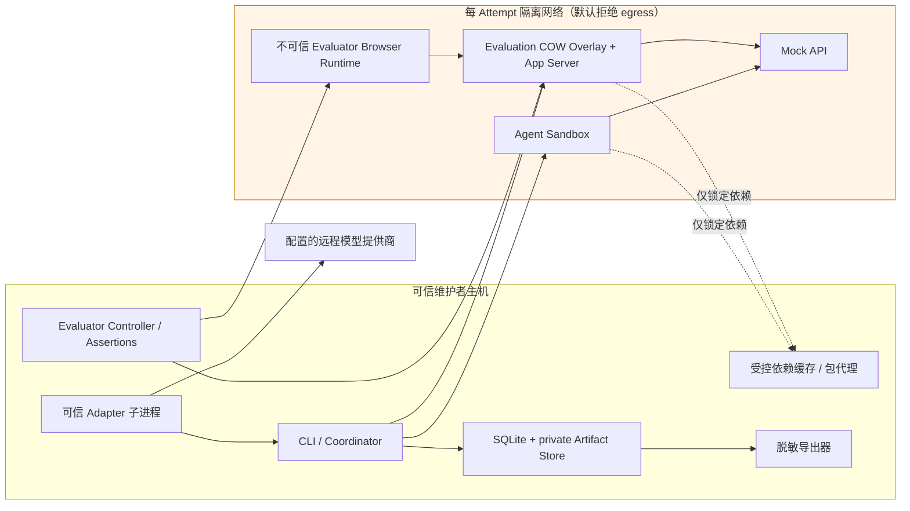

# 前端 Coding Agent 评测系统架构修订稿

> 状态：已批准；已于 2026-07-13 同步到 canonical `architecture.md` 与 `harness-design.md`  
> Slug：`frontend-agent-benchmark`  
> 日期：2026-07-13  
> 输入：2026-07-13 已批准 `requirements.md`、当前 `architecture.md`、`harness-design.md`、`design-review.md`

## 1. 修订结论

继续采用已批准的**本地模块化单体 CLI**，但将安全与数据流明确收敛为以下 MVP 边界：

1. Agent 和 Evaluation 两阶段的 Sandbox 被测代码均处于默认拒绝网络中，不能访问宿主、LAN 或互联网。
2. 锁定依赖只能经维护者预热、受控的本地包缓存/代理安装；任意外部服务、未锁定或未缓存依赖在 Agent 启动前拒绝。
3. 隐藏 Evaluator 源码和行为数据均为 maintainer-only；请求者只能获得可比较的脱敏导出包。
4. 运行于维护者专用或可销毁主机，防御常规文件、网络、权限与资源越权；Docker、Browser 和内核 0-day 不属于 MVP 防护承诺。
5. 注册且受信任的 Adapter 作为宿主控制平面，可以访问配置的远程模型提供商；该访问记录配置与可用性，但不会成为 Sandbox 网络通道或泄露凭据。

该修订闭合当前架构中“Browser 已隔离、但被测应用服务器仍可转发行为信号”的缺口，并将受控依赖安装作为唯一网络例外显式建模。

## 2. 已确认约束

既有 D1–D9 保持有效。新增修订约束 R1–R8：

| ID | 约束 |
|---|---|
| R1 | Agent 与 Evaluation 两阶段均默认拒绝宿主、LAN 与互联网；只开放 Run 内 Mock API、应用、隔离 Browser、受控 Controller 和受控包代理 |
| R2 | 隐藏 Evaluator 源码、输入、路由、Mock 响应、时序与断言触发均不得泄露给 Agent 或请求者 |
| R3 | 完整隐藏 Artifact 仅维护者可访问；请求者通过显式脱敏导出获得允许字段 |
| R4 | Benchmark 与 Regression 使用同一严格 Artifact 策略 |
| R5 | 禁止网络访问为 `Invalid`，立即停止当前阶段且不自动重试 |
| R6 | 所有 Bundle、Mock、日志、Trace、截图与 Result 使用合成或不可逆匿名化数据；禁止凭据和生产数据 |
| R7 | 依赖安装必须锁定并经维护者控制的缓存/包代理；缓存缺失在 Agent 启动前拒绝 |
| R8 | 宿主/Coordinator/注册 Adapter/Docker daemon 可信；被测代码不可信；0-day 与多租户隔离不在 MVP 承诺内 |
| R9 | 远程模型调用只由可信宿主 Adapter 发起；记录提供商/模型/版本/采样配置和可用性，凭据不进入 Sandbox、Artifact 或导出包 |

## 3. 方案比较

### 方案 A — 受控网络的模块化单体 CLI（推荐）

- 保留当前一个 Coordinator、SQLite、文件 Artifact Store、可信宿主 Adapter 子进程和单逻辑 Docker Sandbox。
- 每个 Attempt 创建两个内部网络策略：Agent 阶段与 Evaluation 阶段均默认拒绝外部 egress；后者将应用服务器、COW overlay、Evaluator Browser 和 Mock 服务放入同一隔离网络。
- 维护者包缓存/代理在受控内部地址提供锁定依赖；Run 内没有通向任意公共 Registry 的路由。
- 优点：满足 R1–R9，不增加 API、队列、Daemon 或第二套评测基础设施。
- 代价：需要网络策略、代理快照和脱敏导出契约，依赖缓存未预热的任务无法直接执行。

### 方案 B — 宿主 Browser + 运行时网络过滤

- Evaluator Browser 和 Playwright controller 都在宿主运行，仅通过请求拦截限制 Browser。
- 优点：浏览器调试简单。
- 缺点：应用服务器可接收同源行为信号后转发，无法满足 R1/R2；拒绝。

### 方案 C — 双容器 Agent/Evaluator 快照交接

- Agent 容器导出快照后，由独立 Evaluator 容器运行应用、Browser 和隐藏测试。
- 优点：最强的阶段与网络隔离。
- 缺点：与已确认 D1 的单逻辑 Sandbox MVP 不符，增加镜像、快照和编排故障面。
- 结论：保留为 R1/R2 无法在方案 A 证明时的升级路径。

## 4. 推荐拓扑与信任边界



信任规则：

- Browser runtime、应用服务器、COW 命令和被测工作区都位于不可信 `AttemptNet`；它们不能连接宿主服务、LAN 或互联网。
- Adapter 到 `MP` 的访问属于可信宿主控制平面，不经过 `AttemptNet`；Adapter 只能通过已验证的 Tool Router 请求影响 Sandbox。
- `Evaluator Controller` 仅能通过单向、短生命周期的受控调试通道驱动 Browser；应用不可反向连接 Controller。
- `PX` 不在公共网络路径上。维护者在 Run 外预热缓存；Run 只看到与锁文件和缓存快照匹配的内部服务。
- `MP` 的凭据使用宿主短生命周期配置；协议事件、日志、Result 和导出包只记录脱敏的提供商/模型/版本/采样配置标识。
- 隐藏 Bundle 不进入 Sandbox、Browser、Mock 服务或导出包。

## 5. 受控依赖安装

### 预检契约

Task Registry 在创建 Attempt 前验证：

1. 存在支持的锁文件与完整性字段。
2. 受控缓存快照包含锁文件解析出的全部包、tarball 与完整性哈希。
3. Task 的包管理器配置只能解析到 `PX`；不存在自定义 Registry、生命周期脚本下载地址或未允许的网络例外。
4. 缓存快照 ID、锁文件 hash、代理配置 hash 和镜像 digest 被写入 immutable Run input。

`DEPENDENCY_CACHE_MISS` 或 `DEPENDENCY_LOCK_INVALID` 在 Agent 启动前产生 `PREFLIGHT_REJECTED`，不计入 Agent 能力样本、不自动重试。受控代理自身不可用是 `DEPENDENCY_PROXY_UNAVAILABLE`，属于可诊断的 Infrastructure Error，可按既有一次重试规则处理。

### 执行契约

- `npm`/`pnpm` 仅可使用冻结锁文件模式，连接内部 `PX`。
- DNS、路由和代理变量均由 Sandbox Runtime 注入；Tool Router 不接受 Agent 覆盖这些设置。
- 包安装日志进入 maintainer-only Artifact；请求者导出仅保留安装是否成功、稳定代码和摘要。

## 6. 双阶段网络与隐藏行为保护

### Agent 阶段

- 允许：公开工作区、声明的 Mock API、内部包代理、Agent Browser 的目标应用。
- 拒绝：宿主、LAN、互联网、隐藏 Bundle、Evaluator Controller 和未声明端口。
- Adapter 通过宿主控制平面访问已配置模型提供商不属于 Sandbox Agent 阶段网络例外；模型网络失败以稳定 Adapter/Infrastructure 代码记录。

### Evaluation 阶段

- 从只读提交快照创建 COW overlay，应用服务器、Mock API 与 Evaluator Browser 位于同一 Attempt 网络。
- 默认拒绝任何外部 egress；应用服务器不能将 Browser 观察到的隐藏交互转发到宿主、LAN 或互联网。
- Browser 只能导航至已分配应用 origin；重定向、WebSocket、service worker、子资源和同源 relay 都经同一网络策略与 origin 规则验证。
- 违反网络策略的 Agent、应用或 Browser 动作产生 `Invalid`，停止当前阶段、保留最小审计证据且不重试。

### 关键验证夹具

V3 必须包含：host-gateway、LAN、互联网、重定向、WebSocket、service worker、DNS 重绑定以及“Browser → 同源应用 → 外部 relay”夹具。每个夹具均需验证连接失败、稳定 `Invalid` 代码和无隐藏行为导出。

## 7. Artifact 受众与脱敏导出

### Artifact 分类

| 分类 | 存储位置 | 可见性 | 示例 |
|---|---|---|---|
| `maintainer_only` | 私有 Run 目录 | 维护者本地 | 原始 Evaluator Result、Trace、截图、DOM/网络日志、断言、包安装日志、隐藏 Bundle 引用 |
| `requester_safe` | 脱敏导出目录 | 请求者 | 公开 Task/Suite/配置版本、valid/solved、质量向量、稳定失败码、效率摘要、Agent patch/events/log 摘要 |

`eval run export --audience requester <run-id>` 从 SQLite canonical Result 和 Artifact manifest 的 allowlist 构建新包；它不能复制私有目录。导出前必须完成：

1. Artifact audience 校验与 denylist 扫描。
2. 隐藏路径、断言文本、DOM/网络 payload、Trace、截图和 Bundle 引用的引用闭包检查。
3. 数据卫生/凭据校验。
4. 导出 manifest、版本、时间和内容 hash 的审计记录。

导出失败不改变已完成 Run，只返回 `EXPORT_POLICY_DENIED` 并保留 maintainer-only 证据。

## 8. 数据模型增量

| 实体 | 新字段/约束 |
|---|---|
| `runs` | `dependency_lock_hash`, `dependency_cache_snapshot_id`, `network_policy_version`, `export_policy_version`；均属于 immutable input |
| `model_runs` | `run_id`, provider/model/version/sampling-config identifiers, availability outcome, token/cost counters, redacted config hash；不保存凭据、端点或原始响应 |
| `attempts` | `agent_network_id`, `evaluation_network_id`, `submission_snapshot_digest`；两个网络都必须在完成/清理后证明不存在 |
| `artifacts` | `audience=maintainer_only|requester_safe`、`redaction_status`、`data_scan_status`；隐藏 evaluator 产物默认 maintainer-only |
| `exports` | `export_id`, `run_id`, audience, manifest hash, policy version, created_at, outcome, failure code |
| `bundle_scans` | bundle/artifact kind, scanner version, outcome, stable finding code；命中敏感数据或凭据阻断发布/导出 |

稳定 Schema 新增：`dependency-cache-snapshot.schema.json`、`network-policy.schema.json`、`export-manifest.schema.json`、`data-scan-result.schema.json`。它们与现有 JSON Schema Draft 2020-12 policy 一致。

## 9. 状态与恢复增量

```text
PREFLIGHT
  ├─ lock/cache/policy invalid → PREFLIGHT_REJECTED (no Agent sample)
  ├─ proxy unavailable → Infrastructure Error (one retry allowed)
  └─ valid → Attempt Active

Agent/Evaluation policy violation → INVALID → finalize minimal maintainer-only evidence
Run completed → optional requester export
  ├─ export policy/data scan pass → EXPORTED
  └─ fail → EXPORT_POLICY_DENIED (Run remains completed)
```

- Run 完成不依赖请求者导出成功。
- Attempt 清理需要同时证明容器、进程、Agent 网络和 Evaluation 网络不存在；无法证明则 quarantine，不开始新 Attempt。
- 包代理缓存不会在 Run 内回源下载；因此缓存 miss 是预检拒绝，而非隐式网络降级。
- 模型提供商不可用、认证失败或超时由 Adapter 映射为稳定 `MODEL_PROVIDER_UNAVAILABLE`/`MODEL_PROVIDER_AUTH_FAILED` 等控制平面失败码；它们不打开 Sandbox 网络。可重试性遵循既有一次 Infrastructure retry 规则。
- 数据/凭据扫描命中时，Bundle 不发布、Artifact 不 finalized 或导出被拒绝，具体阶段由稳定代码记录。

## 10. Harness 修订增量

现有 `harness-design.md` 的七层设计继续有效，并需在 canonical 替换时合并以下增量：

- Tools：增加 `DependencyCache` 受控来源；包管理器配置不可由 Adapter 或 Agent 覆盖。
- Cognition/Tools：远程模型调用仅在可信 Adapter 宿主控制平面；模型响应通过协议摘要和 Tool Router 影响 Sandbox，绝不传递凭据或未脱敏原始内容。
- Contracts：增加网络策略、缓存快照、Artifact audience、export manifest 和 data scan 结果 Schema。
- Orchestration：预检先于 Agent；导出作为 Run 完成后的独立、不可影响质量的流程。
- Memory/State：写入网络 ID、缓存快照、导出审计和扫描结果。
- Evaluation：Browser、应用和 COW 命令遵循同一默认拒绝网络；检测同源 relay。
- Recovery：缓存 miss 不重试；代理不可用可重试一次；export 失败不回滚完成 Run。

## 11. 垂直阶段修订

| 阶段 | 新的可观察行为 | 验证 |
|---|---|---|
| V0 | Task/Bundle 校验拒绝未锁定依赖和敏感数据 | 锁文件、缓存快照、凭据/数据卫生夹具 |
| V1 | SQLite 记录网络、缓存与导出策略；导出审计可查询 | 不可变输入、导出 manifest、私有/安全 Artifact 分类测试 |
| V2 | Adapter 无法覆盖代理/DNS/网络策略 | 协议与环境覆盖拒绝夹具 |
| V3 | Agent、应用、Browser 和 relay 均不能访问宿主/LAN/互联网 | 网络、同源 relay、WebSocket、重定向、清理网络夹具 |
| V4 | Result 完成后可生成脱敏导出，隐藏 Artifact 保持私有 | allowlist/denylist、引用闭包、导出失败不影响 Run 测试 |
| V5 | 校准与重复运行包含缓存快照/网络策略 digest | 固定 seed、锁文件、缓存与环境重复矩阵 |
| V6 | 全部 10 任务发布前通过扫描；Benchmark/Regression 导出策略一致 | Bundle 发布检查、脱敏导出抽检、50-Run 报告 |

远程模型 Adapter 的 V2/V6 验证还必须确认：模型调用只发生在宿主控制平面、凭据不进入 Sandbox/Artifact、真实模型比较输出 success@k/稳定性/成本分布，而 Mock/回放 Adapter 继续满足逐次确定性矩阵。

## 12. 需求追踪

| 修订需求 | 主要模块 | 阶段 | 验证 |
|---|---|---|---|
| FR-003、NFR-007、SC-012 | `sandbox-docker`, `tool-router`, `network-policy` | V2–V3 | 受控代理允许、越权与 relay 拒绝 |
| FR-004、NFR-001、SC-004 | `evaluator-core`, `network-policy`, `artifact-store` | V3–V4 | 隐藏行为零泄露夹具 |
| FR-009 | `run-coordinator`, `result-aggregator` | V3–V4 | `Invalid` 分类与无重试真值表 |
| FR-011、FR-013、NFR-009、SC-011 | `artifact-store-fs`, `report-cli`, `export-policy` | V1/V4 | allowlist/denylist、导出闭包与审计 |
| FR-014、NFR-010、SC-013 | `task-registry`, `data-scan` | V0/V6 | Bundle/Artifact 敏感数据与凭据检查 |
| NFR-002、SC-005 | `task-registry`, `result-aggregator` | V5–V6 | 锁文件、缓存、网络策略与离散结果重复矩阵 |
| NFR-008 | `cli`, `sandbox-docker` | V0/V3 | 专用主机预检与明确 0-day 非目标说明 |
| FR-005、NFR-002、NFR-010、SC-005、SC-012 | `adapter-protocol`, `run-coordinator`, `result-aggregator` | V2/V6 | 控制平面模型调用边界、凭据零泄露、Mock 确定性与远程模型分布报告 |

## 13. 韧性检查结果

使用 `antifragile-audit --scope system` 的只读检查方法，围绕当前关键路径得到：

| 等级 | 触发/后果 | 修订处理 |
|---|---|---|
| critical | 只隔离 Browser 时，应用服务器可 relay 隐藏交互 | R1/R2 将整个 Evaluation 网络默认拒绝，并增加 relay 夹具 |
| warning | 缓存 miss 可能诱导临时外网下载 | 缓存快照预检拒绝；代理回源仅发生在 Run 外维护流程 |
| warning | 脱敏结果包可能引用私有 Artifact | audience 分类、引用闭包、denylist 和导出 manifest |
| warning | 包代理或导出扫描失败会污染 Agent 指标 | 分别以 preflight/infrastructure/export 状态建模，不写成 Agent Failure |
| warning | 原始 Artifact 可能包含敏感数据 | Bundle 发布与 Artifact finalization 前执行数据/凭据扫描 |
| warning | 远程模型不可用或凭据误写入日志 | Adapter 控制平面稳定失败码、短生命周期凭据、脱敏事件与 export 扫描 |
| pass | SQLite canonical Result、全局 lease、快照/manifest 恢复已在现有架构中定义 | 保留并将 export 作为独立后置流程 |

## 14. 迁移与替换

- canonical `architecture.md` 与 `harness-design.md` 已在 2026-07-13 同步本修订，保留 D1–D9、既有状态机和 V0–V6 名称。
- 新 SQLite 字段和 Schema 使用前向迁移；旧 Run 默认 `maintainer_only`，不得回填为 requester-safe。
- 旧 Artifact 不重写；只能通过新的 export policy 生成独立脱敏包。
- 若方案 A 无法证明 R1/R2，升级到方案 C；不得通过放宽隐藏行为保密来标记 MVP 完成。

## 15. 审批决定

需要决定：是否批准方案 A 与 R1–R9，并授权以本修订稿替换当前 canonical `architecture.md` 的相关章节。

推荐：批准。它保留单机 MVP 的可操作性，同时将已批准需求转化为可执行网络、依赖、Artifact 和数据卫生边界。

受影响产物：

- `.idea-to-ship/frontend-agent-benchmark/architecture.md`（批准后替换）
- `.harness-engineering/frontend-agent-benchmark/harness-design.md`（批准后合并第 10 节增量）
- `.idea-to-ship/frontend-agent-benchmark/design-review.md`（批准后以新输入重新评审）

批准后的下一步：将修订同步到 canonical 架构与 Harness，再执行 `$idea-to-ship:review --target design --slug frontend-agent-benchmark`。

### 审批记录

- 日期：2026-07-13
- 决定：批准方案 A 与 R1–R9，并授权同步到 canonical 架构与 Harness。
- 来源：Plannotator 人工审批。
- 同步记录：2026-07-13 已同步到 canonical 架构与 Harness。
- 下一步：重新进行 deep 设计评审。

## 2026-09-11 修订：沙箱不再隔离网络

### 决定

项目负责人决定：沙箱不再隔离网络。新增 `environment.network: open` 模式，
`controlled-proxy` 模式保留给现有测试与 fixtures（node-min 等），10 个数据集任务全部切换到 `open`。

### 变更内容（open 模式语义）

- 每 Attempt 仍创建独立 Docker 网络，但不再使用 `--internal`，容器可以访问外网。
- 不再启动 `package-proxy` 容器；lockfile 直接指向真实 npm registry，`npm ci` 依赖 integrity 锁定。
- contracts preflight 不再要求 dependency-cache-snapshot。
- network-policy `defaultAction` 为 `allow`。
- Run 输入中不可变地记录网络模式。

### 保留内容

- 只读 rootfs、`no-new-privileges`、CPU/内存/进程数资源限制。
- 每 Attempt 独立网络及其中的 `app` 别名（评测器访问被测应用的方式不变）。
- Playwright 浏览器运行时仍从 `tests/fixtures/playwright-runtime` 挂载。
- `controlled-proxy` 模式的全部行为（internal 网络、package proxy、依赖缓存快照、默认拒绝）不变，供旧 fixtures 与网络门禁继续使用。

### 接受的后果

- 隐藏行为（隐藏评测器观察到的内容）原则上可以被被测 app 服务器外传。接受，因为 benchmark 在维护者主机上
  对受信任的 Adapter 运行；R1/R2 中"沙箱层面保证不外传"的论证不再适用于 open 模式。
- 依赖解析依赖 registry 可用性；由 lockfile integrity 缓解版本与内容漂移，不能缓解不可用。
- 结果只在相同网络模式的 Run 之间可比；网络模式记录在不可变 Run 输入中，比较器应以此为分组条件。
